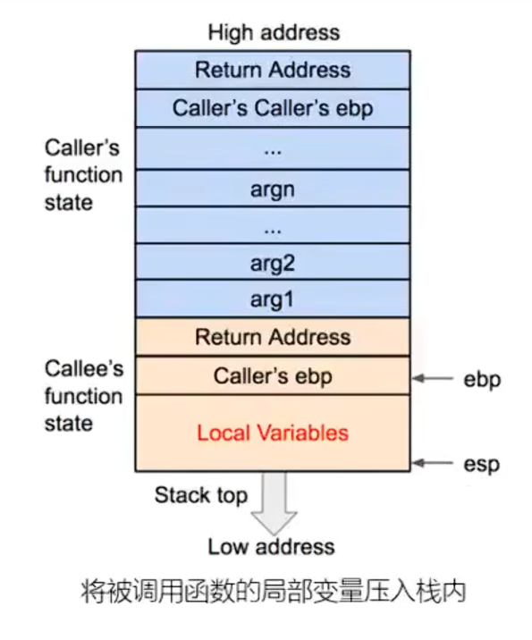
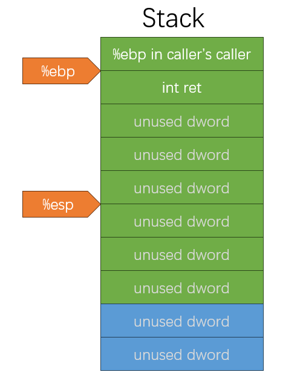

# pwn basic

`更新时间：2024-12-10`

注释解释：

- `<>`必填项，必须在当前位置填写相应数据

- `{}`必选项，必须在当前位置选择一个给出的选项

- `[]`可选项，可以选择填写或忽略

*注：该笔记内的可选项和参数均不完整，如有需要，请查询相关手册*

## 二进制基础

### 程序的编译与链接

从C源代码到可执行文件的生成过程
$$
C \ code \ (p1.c \ p2.c) \\
\downarrow compiler: \ gcc \ -S \\
Assembly \ (p1.s \ p2.s) \\
\downarrow assembler: \ gcc \ or \ as \\
Object \ (p1.o \ p2.o) \ | \ Static Library \ (.a) \\
\downarrow \ linker: \ gcc \ or \ ld \\
Execuatble \ (p)
$$

- 编译：由C语言代码生成汇编代码
- 汇编：由汇编代码生成机器码
- 链接：将多个机器码文件链接为一个可执行文件

**编译**

已知C文件`test.c`

```c
#include <stdio.h>

int main() {
    printf("Hello, World!");
    return 0;
}
```

然后执行`gcc -S test.c`就可以得到汇编文件`test.s`

```assembly
	.file	"test.c"
	.text
	.section	.rodata
.LC0:
	.string	"Hello, World!"
	.text
	.globl	main
	.type	main, @function
main:
.LFB0:
	.cfi_startproc
	endbr64
	pushq	%rbp
	.cfi_def_cfa_offset 16
	.cfi_offset 6, -16
	movq	%rsp, %rbp
	.cfi_def_cfa_register 6
	leaq	.LC0(%rip), %rax
	movq	%rax, %rdi
	movl	$0, %eax
	call	printf@PLT
	movl	$0, %eax
	popq	%rbp
	.cfi_def_cfa 7, 8
	ret
	.cfi_endproc
.LFE0:
	.size	main, .-main
	.ident	"GCC: (Ubuntu 14.2.0-4ubuntu2) 14.2.0"
	.section	.note.GNU-stack,"",@progbits
	.section	.note.gnu.property,"a"
	.align 8
	.long	1f - 0f
	.long	4f - 1f
	.long	5
0:
	.string	"GNU"
1:
	.align 8
	.long	0xc0000002
	.long	3f - 2f
2:
	.long	0x3
3:
	.align 8
4:
```

汇编文件`test.s`本身仍然是一个文本文件，并不是机器码文件

> 

**汇编**
使用`gcc test.s`将汇编文件生成机器码，并生成可执行文件`a.out`

> 

查看`a.out`的文件格式

> 

使用`vim`查看`a.out`的HEX代码

`vim`命令行模式输入`:%!xxd`

> 

*恢复则输入`:%!xxd -r`*

### 可执行文件

**什么是可执行文件**

- 广义上来说，文件中的数据是可以执行的代码的文件就是可执行文件，比如`.out`、`.exe`、`.sh`、`.py`
- 狭义上来说，文件中的数据是机器码的文件是可执行文件，如`.out`、`.exe`、`.dll`、`.so`

**常见可执行文件分类**

- Windows：PE (Portable Executable)
  - 可执行程序`.exe`
  - 动态链接库`.dll`
  - 静态链接库`.lib`

- Linux：ELF (Executable and Linkable Format)
  - 可执行程序`.out`
  - 动态链接库`.so`
  - 静态链接库`.a`

### Linux下的可执行文件格式ELF

**ELF文件格式**

- ELF文件头表：记录了ELF文件的组织结构
- 程序头表/段表：告诉系统如何创建进程，生成进程的可执行文件必须拥有此结构，重定位文件不一定需要
- 节头表：记录了ELF文件的节区信息，用于链接的目标文件必须拥有此结构，其他类型目标文件不一定需要

**组成**
$$
ELF \ header \\
Program \ header \ table \\
\left\{
\begin{array}
..text \\
.rodata \\
\end{array}
\right. \\
\left\{
\begin{array}
.... \\
.data \\
\end{array}
\right. \\
Section \ header \ table
$$

#### EFL文件运行

**从磁盘加载到内存**

ELF文件会先从磁盘加载一份ELF镜像到内存中

> 

在磁盘中，拥有相同访问权限的节会在加载镜像时合并为一个段，如图中的`RW`权限节`.data`、`.bss`、`.got.plt`合并为`Data`段，`RX`权限节`.rodata`、`.text`、`.init`、`ELF Header`合并为`Code`段。CPU通过访问权限来确定哪些是数据段，哪些是代码段

**查看ELF文件结构**

使用`objdump -s a.elf`命令查看ELF文件的结构

```elf
a.elf：     文件格式 elf64-x86-64

Contents of section .interp:
 0318 2f6c6962 36342f6c 642d6c69 6e75782d  /lib64/ld-linux-
 0328 7838362d 36342e73 6f2e3200           x86-64.so.2.    
Contents of section .note.gnu.property:
 0338 04000000 20000000 05000000 474e5500  .... .......GNU.
 0348 020000c0 04000000 03000000 00000000  ................
 0358 028000c0 04000000 01000000 00000000  ................
Contents of section .note.gnu.build-id:
 0368 04000000 14000000 03000000 474e5500  ............GNU.
 0378 8111cc48 4e116f2a cd012b3f 5f19c906  ...HN.o*..+?_...
 0388 5af02af6                             Z.*.            
Contents of section .note.package:
 038c 04000000 60000000 7e1afeca 46444f00  ....`...~...FDO.
 039c 7b227479 7065223a 22646562 222c226f  {"type":"deb","o
 03ac 73223a22 7562756e 7475222c 226e616d  s":"ubuntu","nam
 03bc 65223a22 676c6962 63222c22 76657273  e":"glibc","vers
 03cc 696f6e22 3a22322e 34302d31 7562756e  ion":"2.40-1ubun
 03dc 74753322 2c226172 63686974 65637475  tu3","architectu
 03ec 7265223a 22616d64 3634227d 00000000  re":"amd64"}....
Contents of section .note.ABI-tag:
 03fc 04000000 10000000 01000000 474e5500  ............GNU.
 040c 00000000 03000000 02000000 00000000  ................
Contents of section .gnu.hash:
 0420 02000000 06000000 01000000 06000000  ................
 0430 00008100 00000000 06000000 00000000  ................
 0440 d165ce6d                             .e.m            
Contents of section .dynsym:
 0448 00000000 00000000 00000000 00000000  ................
 0458 00000000 00000000 01000000 12000000  ................
 0468 00000000 00000000 00000000 00000000  ................
 0478 4a000000 20000000 00000000 00000000  J... ...........
 0488 00000000 00000000 22000000 12000000  ........".......
 0498 00000000 00000000 00000000 00000000  ................
 04a8 66000000 20000000 00000000 00000000  f... ...........
 04b8 00000000 00000000 75000000 20000000  ........u... ...
 04c8 00000000 00000000 00000000 00000000  ................
 04d8 13000000 22000000 00000000 00000000  ...."...........
 04e8 00000000 00000000                    ........        
Contents of section .dynstr:
 04f0 005f5f6c 6962635f 73746172 745f6d61  .__libc_start_ma
 0500 696e005f 5f637861 5f66696e 616c697a  in.__cxa_finaliz
 0510 65007072 696e7466 006c6962 632e736f  e.printf.libc.so
 0520 2e360047 4c494243 5f322e32 2e350047  .6.GLIBC_2.2.5.G
 0530 4c494243 5f322e33 34005f49 544d5f64  LIBC_2.34._ITM_d
 0540 65726567 69737465 72544d43 6c6f6e65  eregisterTMClone
 0550 5461626c 65005f5f 676d6f6e 5f737461  Table.__gmon_sta
 0560 72745f5f 005f4954 4d5f7265 67697374  rt__._ITM_regist
 0570 6572544d 436c6f6e 65546162 6c6500    erTMCloneTable. 
Contents of section .gnu.version:
 0580 00000200 01000300 01000100 0300      ..............  
Contents of section .gnu.version_r:
 0590 01000200 29000000 10000000 00000000  ....)...........
 05a0 751a6909 00000300 33000000 10000000  u.i.....3.......
 05b0 b4919606 00000200 3f000000 00000000  ........?.......
Contents of section .rela.dyn:
 05c0 b83d0000 00000000 08000000 00000000  .=..............
 05d0 40110000 00000000 c03d0000 00000000  @........=......
 05e0 08000000 00000000 00110000 00000000  ................
 05f0 08400000 00000000 08000000 00000000  .@..............
 0600 08400000 00000000 d83f0000 00000000  .@.......?......
 0610 06000000 01000000 00000000 00000000  ................
 0620 e03f0000 00000000 06000000 02000000  .?..............
 0630 00000000 00000000 e83f0000 00000000  .........?......
 0640 06000000 04000000 00000000 00000000  ................
 0650 f03f0000 00000000 06000000 05000000  .?..............
 0660 00000000 00000000 f83f0000 00000000  .........?......
 0670 06000000 06000000 00000000 00000000  ................
Contents of section .rela.plt:
 0680 d03f0000 00000000 07000000 03000000  .?..............
 0690 00000000 00000000                    ........        
Contents of section .init:
 1000 f30f1efa 4883ec08 488b05d9 2f000048  ....H...H.../..H
 1010 85c07402 ffd04883 c408c3             ..t...H....     
Contents of section .plt:
 1020 ff359a2f 0000ff25 9c2f0000 0f1f4000  .5./...%./....@.
 1030 f30f1efa 68000000 00e9e2ff ffff6690  ....h.........f.
Contents of section .plt.got:
 1040 f30f1efa ff25ae2f 0000660f 1f440000  .....%./..f..D..
Contents of section .plt.sec:
 1050 f30f1efa ff25762f 0000660f 1f440000  .....%v/..f..D..
Contents of section .text:
 1060 f30f1efa 31ed4989 d15e4889 e24883e4  ....1.I..^H..H..
 1070 f0505445 31c031c9 488d3dca 000000ff  .PTE1.1.H.=.....
 1080 15532f00 00f4662e 0f1f8400 00000000  .S/...f.........
 1090 488d3d79 2f000048 8d05722f 00004839  H.=y/..H..r/..H9
 10a0 f8741548 8b05362f 00004885 c07409ff  .t.H..6/..H..t..
 10b0 e00f1f80 00000000 c30f1f80 00000000  ................
 10c0 488d3d49 2f000048 8d35422f 00004829  H.=I/..H.5B/..H)
 10d0 fe4889f0 48c1ee3f 48c1f803 4801c648  .H..H..?H...H..H
 10e0 d1fe7414 488b0505 2f000048 85c07408  ..t.H.../..H..t.
 10f0 ffe0660f 1f440000 c30f1f80 00000000  ..f..D..........
 1100 f30f1efa 803d052f 00000075 2b554883  .....=./...u+UH.
 1110 3de22e00 00004889 e5740c48 8b3de62e  =.....H..t.H.=..
 1120 0000e819 ffffffe8 64ffffff c605dd2e  ........d.......
 1130 0000015d c30f1f00 c30f1f80 00000000  ...]............
 1140 f30f1efa e977ffff fff30f1e fa554889  .....w.......UH.
 1150 e5488d05 ac0e0000 4889c7b8 00000000  .H......H.......
 1160 e8ebfeff ffb80000 00005dc3           ..........].    
Contents of section .fini:
 116c f30f1efa 4883ec08 4883c408 c3        ....H...H....   
Contents of section .rodata:
 2000 01000200 48656c6c 6f2c2057 6f726c64  ....Hello, World
 2010 2100                                 !.              
Contents of section .eh_frame_hdr:
 2014 011b033b 30000000 05000000 0cf0ffff  ...;0...........
 2024 64000000 2cf0ffff 8c000000 3cf0ffff  d...,.......<...
 2034 a4000000 4cf0ffff 4c000000 35f1ffff  ....L...L...5...
 2044 bc000000                             ....            
Contents of section .eh_frame:
 2048 14000000 00000000 017a5200 01781001  .........zR..x..
 2058 1b0c0708 90010000 14000000 1c000000  ................
 2068 f8efffff 26000000 00440710 00000000  ....&....D......
 2078 24000000 34000000 a0efffff 20000000  $...4....... ...
 2088 000e1046 0e184a0f 0b770880 003f1a39  ...F..J..w...?.9
 2098 2a332422 00000000 14000000 5c000000  *3$"........\...
 20a8 98efffff 10000000 00000000 00000000  ................
 20b8 14000000 74000000 90efffff 10000000  ....t...........
 20c8 00000000 00000000 1c000000 8c000000  ................
 20d8 71f0ffff 23000000 00450e10 8602430d  q...#....E....C.
 20e8 065a0c07 08000000 00000000           .Z..........    
Contents of section .init_array:
 3db8 40110000 00000000                    @.......        
Contents of section .fini_array:
 3dc0 00110000 00000000                    ........        
Contents of section .dynamic:
 3dc8 01000000 00000000 29000000 00000000  ........).......
 3dd8 0c000000 00000000 00100000 00000000  ................
 3de8 0d000000 00000000 6c110000 00000000  ........l.......
 3df8 19000000 00000000 b83d0000 00000000  .........=......
 3e08 1b000000 00000000 08000000 00000000  ................
 3e18 1a000000 00000000 c03d0000 00000000  .........=......
 3e28 1c000000 00000000 08000000 00000000  ................
 3e38 f5feff6f 00000000 20040000 00000000  ...o.... .......
 3e48 05000000 00000000 f0040000 00000000  ................
 3e58 06000000 00000000 48040000 00000000  ........H.......
 3e68 0a000000 00000000 8f000000 00000000  ................
 3e78 0b000000 00000000 18000000 00000000  ................
 3e88 15000000 00000000 00000000 00000000  ................
 3e98 03000000 00000000 b83f0000 00000000  .........?......
 3ea8 02000000 00000000 18000000 00000000  ................
 3eb8 14000000 00000000 07000000 00000000  ................
 3ec8 17000000 00000000 80060000 00000000  ................
 3ed8 07000000 00000000 c0050000 00000000  ................
 3ee8 08000000 00000000 c0000000 00000000  ................
 3ef8 09000000 00000000 18000000 00000000  ................
 3f08 1e000000 00000000 08000000 00000000  ................
 3f18 fbffff6f 00000000 01000008 00000000  ...o............
 3f28 feffff6f 00000000 90050000 00000000  ...o............
 3f38 ffffff6f 00000000 01000000 00000000  ...o............
 3f48 f0ffff6f 00000000 80050000 00000000  ...o............
 3f58 f9ffff6f 00000000 03000000 00000000  ...o............
 3f68 00000000 00000000 00000000 00000000  ................
 3f78 00000000 00000000 00000000 00000000  ................
 3f88 00000000 00000000 00000000 00000000  ................
 3f98 00000000 00000000 00000000 00000000  ................
 3fa8 00000000 00000000 00000000 00000000  ................
Contents of section .got:
 3fb8 c83d0000 00000000 00000000 00000000  .=..............
 3fc8 00000000 00000000 30100000 00000000  ........0.......
 3fd8 00000000 00000000 00000000 00000000  ................
 3fe8 00000000 00000000 00000000 00000000  ................
 3ff8 00000000 00000000                    ........        
Contents of section .data:
 4000 00000000 00000000 08400000 00000000  .........@......
Contents of section .comment:
 0000 4743433a 20285562 756e7475 2031342e  GCC: (Ubuntu 14.
 0010 322e302d 34756275 6e747532 29203134  2.0-4ubuntu2) 14
 0020 2e322e30 00                          .2.0.     
```

**查看内存中进程结构**

使用`gdb a.elf`进入pwngdb

使用`b main`在`main()`函数处断点

使用`r`运行`a.elf`

使用`vmmap`查看进程内存空间结构

> 

其中`STACK`为栈，`HEAP`为堆，`CODE`为代码段，`DATA`为数据段

### 虚拟内存

系统从磁盘加载ELF文件到内存时，不会直接添加到真实内存地址，因为如果进程能够直接访问物理内存地址，就可以对内存中的其他进程进行访问和修改数据，对操作系统造成威胁，所以在当前的计算机系统中，所有的进程都在虚拟内存（地址）中运行。当ELF文件被加载到内存镜像时，进程获取的是操作系统给予的虚拟内存空间，一般小于物理内存

> 

如图，假设该计算机物理内存空间为4GByte，那么系统会预留1GByte的空间作为系统进程的使用空间，然后为每个用户进程分配3GByte的虚拟内存空间。一般用户进程不会占用所有的虚拟内存，所以在物理内存中，只会为虚拟内存中实际占用的部分分配物理内存空间

**进程虚拟内存地址空间**

现代计算机的虚拟内存地址编码一般是以16进制表示，如`0X3C = 0011 1100`

### 段与节

**段 Segment**

在操作系统和计算机体系结构中，内存分段是一种内存管理技术，它将程序的虚拟地址空间划分为若干个称为“段”的逻辑单元。每个段都有自己的起点地址和长度，并且可以独立地进行分配、保护和共享

- 代码段（Text Segment）：存放程序的机器指令
  - `.text`节
  - `.rodata`节
  - `.hash`节
  - `.dynsym`节
  - `dynstr`节
  - `.pit`节
  - `.rel.got`节
  - `......`

- 数据段（Data Segment）：存放全局变量和其他静态分配的数据
  - `.data`节
  - `.dynamic`节
  - `.got`节
  - `.got.plt`节
  - `.bss`节
  - `......`

- 堆段（Heap Segment）：用于动态内存分配，如C语言中的`malloc`或C++中的`new`

- 栈段（Stack Segment）：用于存储局部变量、函数参数、返回地址等

**节 Section**

每个节通常包含特定类型的数据或代码，并且有不同的属性（如是否可读、可写、可执行）。常见的节包括：

- `.text`：存放程序的机器指令
- `.rodata`：存放只读数据，如字符串常量等
- `.plt`：解析动态链接函数的实际地址
- `.data`：存放已初始化的全局变量和静态变量
- `.got.plt`：保存`.plt`节中解析到的实际地址
- `.bss`：存放未初始化的全局变量和静态变量

这些节最终由链接器组合成一个完整的可执行文件或库文件

一个段包含多个节，段视图用于进程的内存区域的rwx权限划分，节视图用于ELF文件编译链接时在磁盘上存储时的文件结构组织

### 程序数据在内存中的组织

已知C代码：

```c
int glb;
char* str = "Hello, World!";

int sum(int x, int y) {
    int t = x * y;
    return t;
}

int main() {
    sum(1, 2);
    void* ptr = malloc(0x100);
    read(0, ptr, 0x100);	// input "deadbeef"
    return 0;
}
```

- `malloc(int capacity)`：动态申请内存空间

- `read(int fd, void *buffer, int size)`：在标准输入中读取输入，并放入`buffer`缓冲区中，最大输入量为`size`字节

在内存中：

| 区域             | 存储数据                            |
| ---------------- | ----------------------------------- |
| Kernel           |                                     |
| Stack            | `t`、`ptr`                          |
| shared libraries |                                     |
| Heap             | `"deadbeef"`                        |
| Bss              | `glb`                               |
| Data             | `str`                               |
| Text             | `main()`、`sum()`、`"Hello, World"` |
| Unused           |                                     |

### 大端序与小端序

在计算机中，每个数值的存放都是一块连续的内存地址，此时，就需要考虑连续内存地址的分配。小端序指将数据低位存放在内存低位，大端序指将数据低位存放在内存高位

- 小端序

已知数据`0x12345678`

| 内存地址 | 数据 |
| -------- | ---- |
| 0        | 0x78 |
| 1        | 0x56 |
| 2        | 0x34 |
| 3        | 0x12 |

- 大端序

已知数据`0x12345678`

| 内存地址 | 数据 |
| -------- | ---- |
| 0        | 0x12 |
| 1        | 0x34 |
| 2        | 0x56 |
| 3        | 0x78 |

### 进程的执行过程

一台计算机的核心部件一般只需要CPU和内存即可。CPU从地址总线访问内存中的某块内存空间，内存通过数据总线返回内存空间中的数据，CPU再通过控制总线从内存中获得相关指令。在CPU中，使用寄存器来暂时保留从内存中获取到的数据，并保留计算后的结果

#### AMD64寄存器结构

- `rax`：8Bytes
- `eax`：4Bytes
- `ax`：2Bytes
- `ah`：1Byte
- `al`：1Byte

#### 部分寄存器的功能

- `RIP`：存放当前执行的指令的地址，32位为`EIP`
- `RSP`：存放当前栈帧的栈顶的地址，32位为`ESP`
- `RBP`：存放当前栈帧的栈底的地址，32位为`EBP`
- `RAX`：通用寄存器，存放函数返回值

#### 静态链接程序的执行过程

$$
$ \ ./binary \ (ELF文件) \\
\downarrow \\
fork() \ (拷贝当前shell虚拟内存空间) \\ 
\downarrow \\
execve("./binary", \ *argv[], \ *envp[]) \ (动态链接库) \\
\downarrow \ kernel \ mode \\
system\_execve() \\
\downarrow \\
do\_execve() \\
\downarrow \\
search\_binary\_handler() \\
\downarrow \\
load\_elf\_binary() \\
\downarrow \ user \ mode \\
\_start \ (程序入口)\\
\downarrow \\
main() \ (主函数)
$$

#### 动态链接程序的执行过程

$$
$ \ ./binary \ (ELF文件) \\
\downarrow \\
fork() \ (拷贝当前shell虚拟内存空间) \\ 
\downarrow \\
execve("./binary", \ *argv[], \ *envp[]) \ (动态链接库) \\
\downarrow \ kernel \ mode \\
system\_execve() \\
\downarrow \\
do\_execve() \\
\downarrow \\
search\_binary\_handler() \\
\downarrow \\
load\_elf\_binary() \\
\downarrow \ user \ mode \\
ld.so \ (第三方库管理) \\
\downarrow \\
\_start \ (程序入口) \\
\downarrow \\
\_\_libc\_start\_main() \\
\downarrow \\
\_init() \\
\downarrow \\
main() \ (主函数)
$$

### 汇编简述

**常用汇编指令**

- `MOV`

  `MOV <SRC>, <DEST>`

  赋值指令，相当于`C`中的`=`，将`<SRC>`数据传递给`<DEST>`，`<SRC>`可以是值，也可以是内存地址，当使用内存地址时，需要使用`[]`，如`MOV EAX, [00404011H]`

- `LEA`
  `LEA <REG>, <SRC>`
  取地址指令，相当于`C`中的`*`，将`<SRC>`的地址传递给`<REG>`

- `ADD / SUB`

- `PUSH`
  `PUSH <VALUE>`
  将`<VALUE>`压入栈，同时使`SP`指针-1字长

- `POP`
  `POP <DEST>`
  将栈顶的数据弹出栈，存放至`DEST`，同时使`SP`指针+1字长

- `CMP`

- `JMP`

- `J[Condition]`

- `CALL`

- `LEAVE`
  在函数返回时，恢复父栈帧的指令。在栈中，每个函数占用一个栈帧，进入子函数时，即进入子函数的栈帧，当子函数调用结束，返回调用函数时，就需要返回调用函数的栈帧
  等效于：
  `MOV ESP, EBP`
  `POP EBP`

- `RET`
  `LEAVE`返回调用函数栈帧后，控制程序执行流依然还在子函数，因此需要`RET`将控制程序执行流返回父函数
  等效于：
  `POP RIP` *注意：RIP本身不能被传递数据，此处仅作演示*

### C语言函数调用栈

函数调用栈是指程序运行时内存一段连续的区域，用来保存函数运行时的状态信息，包括函数参数与局部变量等。称为`栈`是因为发生函数调用时，调用函数`caller`的状态被保存在栈内，被调用函数`callee`的状态被压入调用栈的栈顶。在函数调用结束时，栈顶的函数`callee`状态被弹出，栈顶恢复到调用函数`caller`的状态。函数调用栈在内存中从高地址向低地址生长，所以栈顶对应的内存地址在压栈时变小，退栈时变大

> 

#### 栈帧结构

栈帧是指在程序执行过程中，每当调用一个函数时在调用栈上创建的一个数据结构。每个栈帧包含了函数调用所需的所有信息

下图中，`EBP`到`ESP`之间为子函数栈帧

> 

- `previous stack frame pointer`：爷函数栈帧的栈底指针
- `arguments`：参数
- `return address`：返回地址，当函数完成执行后，程序应该继续执行的指令地址，即父函数的下一条指令地址
- `stack frame pointer`：父函数栈帧的栈底指针
- `callee saved registers`：子函数临时存储空间
- `local variables`：子函数局部变量

#### 函数调用栈的工作过程

函数的状态主要涉及三个寄存器，`ESP`、`EBP`和`EIP`。`ESP`用来存储函数调用栈的栈顶地址，在压栈和退栈时发生变化；`EBP`用来存储函数调用栈的栈底地址，即基地址，在函数运行时不变，可以用来索引确定函数参数或局部变量的位置；`EIP`用来存储即将执行的程序指令的地址，CPU通过`EIP`存储的内容读取指令并执行，`EIP`随之指向相邻的下一个指令，如此反复，程序就可以连续执行指令

**将被调用函数的参数按照逆序依次压入栈**

> 

**将被调用函数的返回地址压入栈**

> 

**将调用函数的栈帧栈底地址压入栈，并将EBP更新为当前栈顶地址**

> 

**将被调用函数局部变量压入栈**

> 

在压栈的过程中，`ESP`寄存器的值不断缩小（对应栈从内存高地址向低地址生长），压入栈内的数据包括调用参数、返回地址、调用函数的基地址，以及局部变量。其中调用参数以外的数据共同构成了被调函数的状态，即栈帧。在发生函数调用时，程序还会将被调函数的指令地址存储到`EIP`寄存器中，这样程序就可以依次执行被调用函数的指令

在栈调用结束后，变化的核心就是丢弃被调用函数的状态，并将栈顶恢复为调用函数的状态

**将调用函数的基地址弹出栈外，并储存到EBP寄存器中**

> 

**将被调用函数的返回地址弹出栈，并使用EIP寄存器储存**

> 

#### 演示

构建C语言代码

```c
int callee(int a, int b, int c) {
    return a + b + c;
}

int caller(void) {
    int ret;
    ret = callee(1, 2, 3);
    ret += 4;
    return ret;
}
```

编译为汇编代码

```assembly
000000012 <caller>:
  12:   55                      push   %ebp
  13:   89 e5                   mov    %esp,%ebp
  15:   83 ec 10                sub    $0x10,%esp
  18:   6a 03                   push   $0x3
  1a:   6a 02                   push   $0x2
  1c:   6a 01                   push   $0x1
  1e:   e8 fc ff ff ff          call   1f <caller+0xd>
  23:   83 c4 0c                add    $0xc,%esp
  26:   89 45 fc                mov    %eax,-0x4(%ebp)
  29:   83 45 fc 04             addl   $0x4,-0x4(%ebp)
  2d:   8b 45 fc                mov    -0x4(%ebp),%eax
  30:   c9                      leave
  31:   c3                      ret
000000000 <callee>:
  0:    55                      push   %ebp
  1:    89 e5                   mov    %esp,%ebp
  3:    8b 55 08                mov    0x8(%ebp),%edx
  6:    8b 45 0c                mov    0xc(%ebp),%eax
  9:    01 c2                   add    %edx,%eax
  b:    8b 45 10                mov    0x10(%ebp),%edx
  e:    01 d0                   add    %edx,%eax
  10:   5d                      pop    %ebp
  11:   c3                      ret
```

- **caller**

1. `push %ebp`：压入调用函数的函数状态

   >  

2. `mov %esp,%ebp`：将`ESP`抬高到`EBP`

   > 

3. `sub $0x10,%esp`：开辟内存空间，大小为`ESP`下面16个地址（字节）长度，即`int ret`声明变量

   > 

4. `push $0x3`、`push $0x2`、`push $0x1`：将被调函数的参数逆序压入栈

   > 

5. `call 1f <caller+0xd>`：将返回地址压入栈，然后将`EIP`设置为被调函数

   > 

- **callee**

6. `push %ebp`：压入调用函数的函数状态

   > 

7. `mov %esp,%ebp`：将`ESP`抬高到`EBP`

   > 

8. `mov 0x8(%ebp),%edx`：将`EBP`+8位置的值，即第一个参数存储到`EDX`寄存器中

9. `mov 0xc(%ebp),%eax`：将第二个参数存储到`EAX`寄存器中

10. `add %edx,%eax`：将两个寄存器的值相加，并储存到`EAX`寄存器中

11. `mov 0x10(%ebp),%edx`：将第三个参数存储到`EDX`寄存器中

12. `add %edx,%eax`：将两个寄存器的值相加，并储存到`EAX`寄存器中

13. ` pop %ebp`：弹出栈顶的值，即父函数的`EBP`，存储到`EBP`寄存器中，使函数状态回到父函数

    > 

14. `ret`：弹出栈顶的值，存入`EIP`，使程序控制流返回父函数

    > 

- **caller**

15. `add $0xc,%esp`：将`ESP`抬高12个地址，释放被调用函数参数的内存空间

    > 

16. `mov %eax,-0x4(%ebp)`：将`EAX`寄存器中的值储存在`EBP`下方4个内存地址的空间

    > 

17. `addl $0x4,-0x4(%ebp)`：将`EBP`下方4个内存地址空间中的值加上4

    > 

18. `mov -0x4(%ebp),%eax`：将`EBP`下方4个内存地址空间中的值传递给`EAX`寄存器

19. `leave`：恢复爷函数的栈帧

20. `ret`：将程序控制流返回爷函数

## 缓冲区溢出

根据上文可知，当函数正在执行内部指令的过程中我们无法拿到程序的控制权，只有发生函数调用或者结束函数调用的时候，程序的控制权会在函数状态之间发生跳转，这时才可以通过修改函数状态来实现攻击。而控制程序执行指令最关键的寄存器就是`EIP`，所以我们的目标就是让`EIP`载入攻击指令的地址

如果要让`EIP`指向攻击指令，首先，在退栈过程中，返回地址会被传给`EIP`，所以我们只需要让溢出数据用攻击指令的地址来覆盖返回地址就行了。其次，我们可以在溢出数据内包含一段攻击指令，也可以在内存其他位置寻找可用的攻击指令

缓冲区溢出的本质是向定长的缓冲区中写入了超长的数据，造成超长的数据覆写了合法内存区域

- 栈溢出
  - 最常见，漏洞比例最高，危害最大的二进制漏洞
  - 在CTF PWN中往往是漏洞利用的基础

- 堆溢出
  - 现实中的漏洞占比不高
  - 堆管理复杂，利用花样繁多
  - CTF PWN中的常见题型
- BSS溢出
  - 现实中与CTF比赛都不常见
  - 攻击效果依赖于BSS上存放了何种控制数据

### 演示

向8字节缓冲区中写入超过8字节的数据

```c
#include <stdio.h>
#include <unistd.h>

int main() {
    // 定义8字节缓冲区
    char str[8];
    // 向缓冲区内写入数据，最大长度24字节
    read(0, str, 24);
    
    return 0;
}
```

>  

> 


### 常用工具

- **IDA Pro**

反编译软件，可以将机器码反编译为汇编代码，同时可以将汇编代码转换为C语言代码

简单的逆向工程是pwn的基础，只有先通过代码分析查找程序可能存在的漏洞，才能进行后续步骤

- **pwntools**

基于python的pwn攻击脚本库

**常用方法**

| 方法名             | 参数类型 | 返回值类型 | 方法意义                                         |
| ------------------ | -------- | ---------- | ------------------------------------------------ |
| process            | str      | object     | 连接本地的程序，并挂载到本地端口，返回程序控制流 |
| remote             | str      | object     | 连接到远程端口，返回程序控制流                   |
| Object.recv        | None     | None       | 接收程序发送的信息                               |
| Object.recvline    | None     | None       | 接收一条程序发送的信息                           |
| Object.send        | byte     | None       | 发送字节流到程序                                 |
| Object.sendline    | byte     | None       | 发送一条字节流到程序                             |
| Object.interactive | None     | None       | 切换到交互模式，即getshell                       |
| p32                | int      | byte       | 将整型转换为32位byte                             |
| p64                | int      | byte       | 将整型转换为64位byte                             |

- **pwndbg**

动态调试工具
**常用指令**

| 指令       | 参数               | 意义                       |
| ---------- | ------------------ | -------------------------- |
| run / r    | N/A                | 运行程序                   |
| break / b  | address / function | 在指定地址或函数处断点     |
| next / n   | N/A                | 步过当前语句               |
| stepin / s | N/A                | 步进当前语句               |
| stack      | length             | 查看当前栈中指定长度的内容 |

- **checksec**

检查程序启用的保护措施

**NX `the no-execute bits`**

栈缓冲区不可执行，编译时生效，通过在内存页的标识中添加“执行”位，可以表示该内存页是否可以执行，若程序代码的`eip`执行至不可运行的内存页，则cpu将直接拒绝执行“指令”，造成程序崩溃

**ASLR `address space layout randomization`**

地址空间布局随机化，通过随机化程序和库的内存地址，ASLR 增加了攻击者猜测或预测内存位置的难度，从而防止了一些常见的攻击方式。ASLR 的核心原理是当程序或库加载到内存中时，其地址空间不会是固定的，而是会随机变化。这意味着每次程序启动时，它的代码段、堆、栈等内存区域的地址都不同，从而大大提高了攻击者利用内存漏洞进行攻击的难度

- **ROPgadget**
- **one_gadget**

### ret2text

*此处使用`NewStarCTF公开赛`的`ret2text`文件*

1. 使用`checksec`检查文件安全性

   > 

   上图中可以看到文件安全性较低

2. 使用`IDA Pro`寻找溢出点

   > 

   `buf`缓冲区仅有32字节，而`read()`函数写入了256字节，存在栈溢出漏洞

3. 寻找攻击点

   > 

   在`backdoor()`函数中可以直接`getshell`

4. 使用`gdb`进行动态调试

   > 

5. 在`main()`函数处断点

   > 

6. 运行程序，并步过到`read()`函数

   > 

7. 继续步过，输入合法内容，然后使用`stack`命令查看当前栈

   > 

8. 从上图中可以看出，`0x7fffffffdd48`地址，即`rbp +8`的地址就是函数的返回地址，也就是我们需要溢出覆盖的位置。现在返回`IDA Pro`，查看`backdoor()`函数的的内存地址，这个地址就是需要覆盖的`0x7fffffffdd48`地址的值

   > 

9. 已知后门函数的地址为`0x04011FB`，现在我们需要计算覆盖函数返回地址需要的字节数。在上文中可以看到`rbp`前的字节数是`0x20`，即32字节，而在64位系统中，`rbp`本身需要占用8字节，因此总共需要40字节的垃圾数据，然后拼接需要返回的函数地址`0x04011FB`
   ```py
   from pwn import *
   
   # 连接本地程序
   io = process('./ret2text')
   # shell地址
   shell = 0x004011FB
   # payload
   payload = b'A' * 32 + b'B' * 8 + p64(shell)
   
   io.recvline()
   io.sendline(payload)
   io.interactive()
   ```

   *注：如果是32位系统，`ebp`的长度为4字节，拼接地址时使用的方法也应该改为`p32()`*

10. 执行脚本，成功`getshell`

    > 

### ret2shellcode

在`ret2text`中，我们使用的`shell`是题目中为我们预留好的，但是实际的比赛中基本不可能为我们预留这样一条危险的代码，因此我们需要自己向程序中输入shellcode

具体步骤是将栈帧上的函数返回地址更改为攻击者手动传入的shellcode所在的缓冲区地址，初期往往直接将shellcode写入栈缓冲区，但是目前由于NX保护措施，栈缓冲区不可执行，因此当下常用的手段变为向bss缓冲区或者堆缓冲区内写入shellcode，并使用mprotect赋予其执行权限

